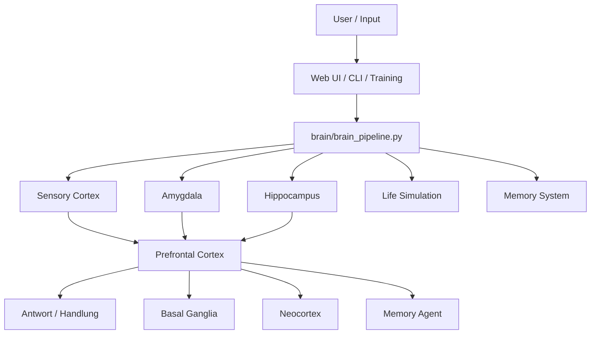

# CHAPPiE

CHAPPiE ist ein brain-inspiriertes KI-System mit **Multi-Agent-Architektur**, **episodischem Gedächtnis**, **Sleep-Phase/Konsolidierung**, **Life-Simulation** und **autonomem Training**.

Der Fokus des Projekts liegt darauf, eine **verständliche, menschenlesbare und agent-taugliche Architektur** zu bauen: nicht als biologisch exakte Kopie des Gehirns, sondern als technische Simulation von Rollen wie Wahrnehmung, Emotion, Gedächtnis, Planung und Langzeitentwicklung.

## Schnellnavigation

- [Agent-Guide](agent.md)
- [Dokumentationsindex](docs/README.md)
- [Architektur & Gehirn-Metapher](docs/architecture.md)
- [Workflows](docs/workflows.md)
- [Lokale Modelle & Fallbacks](docs/local-models.md)
- [Projektkarte / Ordnerstruktur](docs/project-map.md)
- [Testing](docs/testing.md)
- [Deployment](docs/deployment.md)

## Was CHAPPiE ausmacht

- **Brain Pipeline** mit spezialisierten Agenten
- **Memory System** mit Retrieval, Kontextdateien, Vergessenskurve und Schlafphase
- **Life Simulation** mit Needs, Goals, Habits, Development und Beziehungskurve
- **Growth Layer** mit Planung, Forecasting und Timeline
- **Web UI**, **CLI** und **Training-Daemon** als verschiedene Betriebsmodi
- **lokale Modellstrategie** mit Qwen-3.5 als bevorzugtem Zielbild

## Gehirn-Metapher auf einen Blick



Mehr dazu: [docs/architecture.md](docs/architecture.md)

## Für wen diese README gedacht ist

### Für Menschen

Diese Datei erklärt, **was** CHAPPiE ist, **wo** man weiterlesen sollte und **wie** man das Projekt startet.

### Für KI-Agents

Die operative Arbeitsdatei ist [agent.md](agent.md). Dort steht insbesondere:

- welche Doku bei Änderungen geprüft werden muss
- welche Dateien welche Themen erklären
- welche Regeln vor Pushes gelten
- welche Infrastrukturregeln nicht verletzt werden dürfen

## Projektprinzipien

1. **Lesbarkeit vor Mythenbildung**  
   Die Gehirn-Metapher dient dem Verstehen und Strukturieren, nicht als pseudo-wissenschaftliche Behauptung.
2. **Lokale Modelle zuerst**  
   Qwen-3.5 lokal ist die gewünschte Hauptrichtung; APIs sind sekundär.
3. **Doku ist Teil der Implementierung**  
   Wenn Architektur, Workflows, Ordner oder Modelle sich ändern, muss die Doku mitziehen.
4. **Pfadgenaue Referenzen**  
   Wichtige Aussagen sollen auf konkrete Dateien verweisen.

## Schnellstart

### 1. Installation

```bash
git clone https://github.com/017pixel/CHAPPiE.git
cd CHAPPiE
python -m venv venv
source venv/bin/activate   # Windows: .\venv\Scripts\activate
pip install -r requirements.txt
```

### 2. Konfiguration

- Vorlage: [`config/secrets_example.py`](config/secrets_example.py)
- zentrale Laufzeitsettings: [`config/config.py`](config/config.py)
- Brain-Modellverteilung: [`config/brain_config.py`](config/brain_config.py)

Empfohlene Richtung: **lokale Qwen-3.5-Modelle via vLLM**, API-Provider nur als Fallback. Details: [docs/local-models.md](docs/local-models.md)

### 3. Startmodi

#### Web UI

```bash
streamlit run app.py
```

#### Brain CLI

```bash
python chappie_brain_cli.py
```

#### Training-Daemon

```bash
python -m Chappies_Trainingspartner.training_daemon --neu
python -m Chappies_Trainingspartner.training_daemon --fokus "Architektur"
```

Wichtig:

- `chappie-training.service` muss auf `Chappies_Trainingspartner.training_daemon` zeigen
- **nicht** auf `training_loop.py`
- `Restart=always` und absolute Pfade sind für Service-Dateien Pflicht

Mehr dazu: [docs/deployment.md](docs/deployment.md)

## Dokumentationskarte

| Thema | Datei |
|---|---|
| Projektüberblick | [`README.md`](README.md) |
| Agent-Regeln / Push-Checkliste | [`agent.md`](agent.md) |
| Gehirn-Analogie & Komponenten | [`docs/architecture.md`](docs/architecture.md) |
| Anfrage-, Schlaf-, Training- und UI-Workflows | [`docs/workflows.md`](docs/workflows.md) |
| Modellstrategie lokal vs. API | [`docs/local-models.md`](docs/local-models.md) |
| Orientierung in der Codebasis | [`docs/project-map.md`](docs/project-map.md) |
| Teststrategie | [`docs/testing.md`](docs/testing.md) |
| Konkrete Testdateien | [`tests/README.md`](tests/README.md) |
| Deployment / Services | [`docs/deployment.md`](docs/deployment.md) |

## Wichtige Projektbereiche

- [`brain/`](brain) – Brain-Pipeline, Agenten, Global Workspace, Action Layer
- [`memory/`](memory) – Memory Engine, Forgetting Curve, Sleep Phase, Kontextdateien
- [`life/`](life) – Homeostasis, Planning, Forecast, Social Arc, Timeline
- [`web_infrastructure/`](web_infrastructure) – Streamlit-UI, Dashboards, Command Handling
- [`Chappies_Trainingspartner/`](Chappies_Trainingspartner) – autonomes Training
- [`data/`](data) – Kontext- und Laufzeitdaten

## Tests und sichere Verifikation

Schnelle lokale Checks:

```bash
python tests/test_forgetting_curve.py
python tests/test_life_simulation.py
python tests/manual/test_compatibility.py
python -m Chappies_Trainingspartner.training_daemon --help
```

Mehr Einordnung: [docs/testing.md](docs/testing.md) und [tests/README.md](tests/README.md)

## Datenhinweis

Der Ordner [`data/`](data) enthält sensible lokale Zustände und Gedächtnisdateien. Nicht unbedacht löschen. Siehe [`data/README_GEDAECHTNIS_WARNUNG.txt`](data/README_GEDAECHTNIS_WARNUNG.txt).

## Legacy-Hinweis

Der Ordner [`Info Dateien/`](Info%20Dateien) enthält nur noch kurze Brücken auf die neue Struktur. Die aktuelle Hauptdokumentation ist jetzt:

- `README.md`
- `agent.md`
- `docs/`

