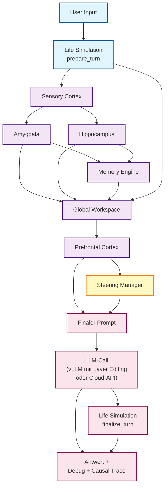
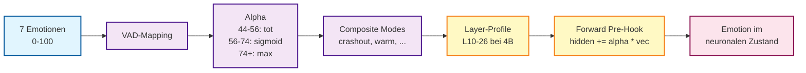

# CHAPPiE

CHAPPiE ist eine experimentelle Cognitive-Agent-Architektur, die versucht, menschliches Verhalten durch die Kombination von LLMs, episodischem Gedaechtnis und einer kontinuierlichen Life-Simulation zu modellieren.

Im Gegensatz zu klassischen Chatbots besitzt CHAPPiE interne Zustaende wie Emotionen, Beduerfnisse und langfristige Ziele. Er entwickelt sein Verhalten ueber Zeit durch Memory, Simulation und Training weiter.

**Ein Agent, der sich an vergangene Interaktionen erinnert, emotionale Zustaende entwickelt und sein Verhalten langfristig anpasst.**

---

## Das Problem

LLMs haben kein echtes Gedaechtnis. Jede Sitzung faengt bei Null an. Sie haben keine Entwicklung, keine Beduerfnisse, keine emotionale Kontinuitaet. Sie reagieren – sie erleben nicht.

## Die Idee

CHAPPiE setzt auf drei Saeulen, die zusammen ein konsistentes Innenleben erzeugen:

| Saeule | Was sie bringt | Forschungsfeld |
|---|---|---|
| **Episodisches Gedaechtnis** | Vergangene Interaktionen werden gespeichert, retrieved, verdichtet und vergessen | Memory-Augmented LLMs |
| **Life-Simulation** | Needs, Goals, Habits, Attachment, Development-Stufen – ein kontinuierlicher innerer Zustand | Agent Systems, Simulation-based AI |
| **Emotion Steering** | Emotionen werden nicht nur im Prompt beschrieben, sondern direkt in die Hidden States des Modells injiziert | Affective Computing |

## Was CHAPPiE besonders macht

- **Brain-Pipeline** mit spezialisierten Modulen (Sensory, Amygdala, Hippocampus, Prefrontal Cortex) und einem Global Workspace, der Signale nach Salience priorisiert
- **Life-System** mit Homeostasis, Goal Competition, Habit Dynamics, Attachment-Modell und autobiografischer Timeline
- **Layer Steering** (Activation Steering): Emotionen werden als Vektoren in die neuronalen Schichten des lokalen Modells injiziert – nicht nur als Text im Prompt
- **Sleep-Phase** mit Replay, Verdichtung und Vergessenskurve – echtes "Gedaechtnisdenken"
- **Causal Trace**: Jede Antwort ist nachvollziehbar – Input, Memory, Emotion, Steering, Ton

---

## Architektur



### Emotion-Steering (lokal)



---

## Schnellstart

### 1. Installation

```bash
git clone https://github.com/017pixel/CHAPPiE.git
cd CHAPPiE
python -m venv venv
source venv/bin/activate
pip install -r requirements.txt
```

Frontend:

```bash
cd frontend
npm install
cd ..
```

### 2. Konfiguration

- [`config/secrets_example.py`](config/secrets_example.py)
- [`config/config.py`](config/config.py)

Empfohlen:

- `LLM_PROVIDER = "vllm"`
- lokaler Endpoint auf `http://localhost:8000/v1`
- Qwen-3.5 lokal zuerst, APIs nur Fallback

Details: [docs/local-models.md](docs/local-models.md)

### 3. Starten

```bash
# API
uvicorn api.main:app --reload --port 8010

# Frontend
cd frontend && npm run dev

# Training
python -m Chappies_Trainingspartner.training_daemon --neu
```

Mehr Startoptionen: [docs/deployment.md](docs/deployment.md)

---

## Forschungsfelder

CHAPPiE bewegt sich an der Schnittstelle mehrerer etablierter Forschungsgebiete:

- **Cognitive Architectures** – modulare Architektur nach kognitiver Trennung
- **Agent Systems** – autonome Agenten mit internem Zustandsmodell
- **Memory-Augmented LLMs** – episodisches Gedaechtnis mit Retrieval und Vergessen
- **Affective Computing** – Emotion Steering via Activation Steering
- **Simulation-based AI** – Life-Simulation als kontinuierliche Umgebung

---

## Schnellnavigation

- [Agent-Guide](agent.md)
- [Dokumentationsindex](docs/README.md)
- [Architektur & Gehirn-Metapher](docs/architecture.md)
- [Workflows](docs/workflows.md)
- [Lokale Modelle](docs/local-models.md)
- [vLLM-Setup](docs/vLLM-Setup.md)
- [Projektkarte](docs/project-map.md)
- [Testing](docs/testing.md)
- [Deployment](docs/deployment.md)

---

## Wichtige Projektbereiche

- [`brain/`](brain) – Brain-Pipeline, Agenten, Steering, Global Workspace
- [`memory/`](memory) – Gedaechtnis, Konsolidierung, Kontextdateien
- [`life/`](life) – inneres Zustandsmodell und Entwicklung
- [`api/`](api) – FastAPI-App fuer den Webpfad
- [`frontend/`](frontend) – React/Vite/TypeScript-Frontend
- [`web_infrastructure/`](web_infrastructure) – UI-freie Brueckenschicht
- [`Chappies_Trainingspartner/`](Chappies_Trainingspartner) – autonomes Training
- [`config/`](config) – Provider-, Prompt- und Modellkonfiguration
- [`data/`](data) – Laufzeitdaten, Memories, Kontextdateien

---

## Datenhinweis

[`data/`](data) ist sensibel: enthaelt Kontextdateien, Memory-Daten und lokale Zustaende. Nicht unbedacht loeschen. Siehe [`data/README_GEDAECHTNIS_WARNUNG.txt`](data/README_GEDAECHTNIS_WARNUNG.txt).

## Legacy-Hinweis

[`Info Dateien/`](Info%20Dateien) enthaelt nur noch kurze Bruecken. Die aktuelle Hauptdokumentation ist `README.md`, `agent.md` und `docs/`.
