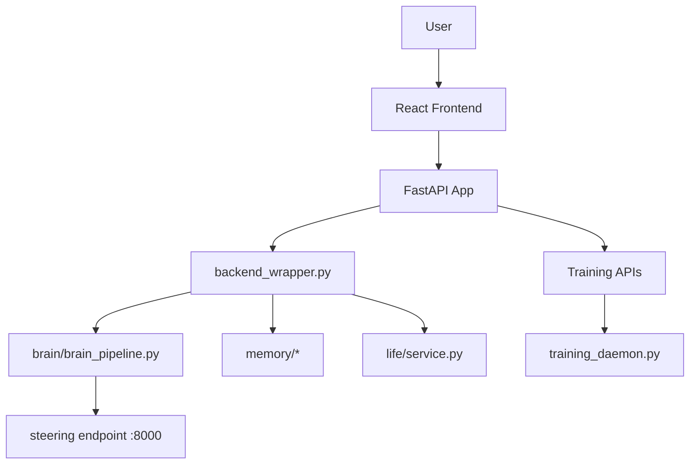
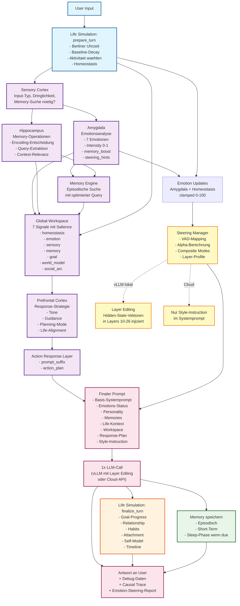

# CHAPPiE

CHAPPiE ist ein brain-inspiriertes KI-System mit Multi-Agent-Architektur, episodischem Gedaechtnis, Sleep-Phase, Life-Simulation und autonomem Training.

Die Weboberflaeche laeuft jetzt ueber eine getrennte Architektur:

- [`api/main.py`](api/main.py) als FastAPI-App
- [`frontend/`](frontend) als React/Vite-Frontend
- [`web_infrastructure/backend_wrapper.py`](web_infrastructure/backend_wrapper.py) als UI-freie Fachlogik-Bruecke

## Schnellnavigation

- [Agent-Guide](agent.md)
- [Dokumentationsindex](docs/README.md)
- [Architektur](docs/architecture.md)
- [Workflows](docs/workflows.md)
- [Lokale Modelle](docs/local-models.md)
- [vLLM-Setup](docs/vLLM-Setup.md)
- [Projektkarte](docs/project-map.md)
- [Testing](docs/testing.md)
- [Deployment](docs/deployment.md)

## Was CHAPPiE ausmacht

- Brain-Pipeline mit spezialisierten Agenten
- Memory-System mit Retrieval, Kontextdateien, Vergessenskurve und Sleep-Phase
- Life-Simulation mit Needs, Goals, Habits, Forecast und Timeline
- Training-Daemon fuer kontinuierliches Lernen
- App-API plus React-Frontend fuer den Webbetrieb
- lokale Modellstrategie mit Qwen-3.5 und steering-faehigem `vllm`-Pfad
- Debug- und Monitor-Daten fuer Input, Memory, Emotion, Tone und Runtime

## Schnellstart

### 1. Installation

```bash
git clone https://github.com/017pixel/CHAPPiE.git
cd CHAPPiE
python -m venv venv
source venv/bin/activate
pip install -r requirements.txt
```

Frontend lokal:

```bash
cd frontend
npm install
cd ..
```

### 2. Konfiguration

Wichtige Dateien:

- [`config/secrets_example.py`](config/secrets_example.py)
- [`config/config.py`](config/config.py)
- [`config/brain_config.py`](config/brain_config.py)

Empfohlene Richtung:

- `LLM_PROVIDER = "vllm"`
- lokaler steering-faehiger Endpoint auf `http://localhost:8000/v1`
- Qwen-3.5 lokal zuerst
- APIs nur als Fallback

Details: [docs/local-models.md](docs/local-models.md)

### 3. Starten

App-API:

```bash
uvicorn api.main:app --reload --port 8010
```

React-Frontend:

```bash
cd frontend
npm run dev
```

Kompatibilitaets-Launcher:

```bash
python app.py
```

Brain CLI:

```bash
python chappie_brain_cli.py
```

Training:

```bash
python -m Chappies_Trainingspartner.training_daemon --neu
```

## Betriebsbild

### Architektur-Uebersicht



### Wie CHAPPiE "denkt" – Die Brain-Pipeline



### Emotion-Steering im Detail

```mermaid
flowchart LR
    Emotions["7 Emotionen\n0-100"] --> VAD["VAD-Mapping\nValence, Arousal, Dominance"]
    VAD --> Alpha["Alpha-Berechnung\nToter Bereich: 44-56\nSigmoid ab 56\nMax ab 74"]
    Alpha --> Composite["Composite Modes\ncrashout, guarded,\nmelancholic, warm, charged"]
    Composite --> Layers["Layer-Profile\nQwen3.5-4B: L10-26\nQwen2.5-32B: L20-44"]
    Layers --> Injection["Forward Pre-Hook\nhidden_state += alpha * vector"]
    Injection --> Output["Modifizierter Output\nEmotion direkt im\nneuronalen Zustand"]

    classDef emofill:#e1f5fe,stroke:#01579b,stroke-width:2px
    classDef procfill:#f3e5f5,stroke:#4a148c,stroke-width:2px
    classDef layerfill:#fff9c4,stroke:#f57f17,stroke-width:2px
    classDef outfill:#fce4ec,stroke:#880e4f,stroke-width:2px

    class Emotions emofill
    class VAD,Alpha,Composite procfill
    class Layers,Injection layerfill
    class Output outfill
```

### Wie CHAPPiE "denkt" – Die Brain-Pipeline


### Emotion-Steering im Detail

```mermaid
flowchart LR
    Emotions["7 Emotionen\n0-100"] --> VAD["VAD-Mapping\nValence, Arousal, Dominance"]
    VAD --> Alpha["Alpha-Berechnung\nToter Bereich: 44-56\nSigmoid ab 56\nMax ab 74"]
    Alpha --> Composite["Composite Modes\ncrashout, guarded,\nmelancholic, warm, charged"]
    Composite --> Layers["Layer-Profile\nQwen3.5-4B: L10-26\nQwen2.5-32B: L20-44"]
    Layers --> Injection["Forward Pre-Hook\nhidden_state += alpha * vector"]
    Injection --> Output["Modifizierter Output\nEmotion direkt im\nneuronalen Zustand"]

    classDef emofill:#e1f5fe,stroke:#01579b,stroke-width:2px
    classDef procfill:#f3e5f5,stroke:#4a148c,stroke-width:2px
    classDef layerfill:#fff9c4,stroke:#f57f17,stroke-width:2px
    classDef outfill:#fce4ec,stroke:#880e4f,stroke-width:2px

    class Emotions emofill
    class VAD,Alpha,Composite procfill
    class Layers,Injection layerfill
    class Output outfill
```

## Web- und API-Pfade

Der Webpfad ist jetzt final getrennt:

- Frontend rendert Chat, Debug, Training, Context, Memories, Life, Growth und Visualizer
- API kapselt Chat, Sessions, Runtime-Settings, Memory-Zugriffe und Trainingssteuerung
- `memory/chat_manager.py` bleibt Source of Truth fuer Sessions
- `backend_wrapper.py` ist nicht mehr an ein UI-Framework gekoppelt

## Modellstrategie

- lokale Qwen-3.5-Modelle zuerst
- `vllm` bevorzugt
- Ollama als leichter lokaler Fallback
- Cloud-Provider nur, wenn lokal nicht praktikabel

Fuer lokales Steering gilt:

- Emotionen werden ueber Payload und Layer-Steuerung transportiert
- Settings und Monitor-Daten laufen ueber API und Frontend
- derselbe Endpoint sollte fuer App-API, CLI und Training verwendet werden
- fuer den Produktivserver kann `chappie-vllm.service` bewusst auf `Qwen/Qwen3.5-9B` uebersteuert werden, ohne den lokalen 4B-Default zu aendern

## Wichtige Projektbereiche

- [`brain/`](brain)
- [`memory/`](memory)
- [`life/`](life)
- [`api/`](api)
- [`frontend/`](frontend)
- [`web_infrastructure/`](web_infrastructure)
- [`Chappies_Trainingspartner/`](Chappies_Trainingspartner)
- [`data/`](data)

## Verifikation

Schnelle Checks:

```bash
python tests/test_api_contract.py
python tests/test_chat_ui_formatting.py
python tests/test_training_config_ui.py
python tests/test_chat_manager_persistence.py
python tests/test_web_ui_consistency.py
python -m py_compile app.py api/main.py web_infrastructure/backend_wrapper.py
cd frontend && npm run build
```

Mehr Details: [docs/testing.md](docs/testing.md)

## Services und Deployment

Wichtige Service-Dateien:

- [`chappie-vllm.service`](chappie-vllm.service)
- [`chappie-training.service`](chappie-training.service)
- [`chappie-web.service`](chappie-web.service) fuer die App-API
- [`chappie-frontend.service`](chappie-frontend.service) fuer das Frontend

Wichtig:

- `chappie-training.service` muss `-m Chappies_Trainingspartner.training_daemon` starten
- `Restart=always` beibehalten
- absolute Pfade in `ExecStart` und `WorkingDirectory`
- das Frontend kann den API-Host automatisch aus dem aktuellen Browser-Host ableiten; `VITE_API_BASE_URL` bleibt nur ein Override

Mehr dazu: [docs/deployment.md](docs/deployment.md)

## Datenhinweis

[`data/`](data) enthaelt lokale Zustaende, Memories und Kontextdateien. Nicht unbedacht loeschen. Siehe [`data/README_GEDAECHTNIS_WARNUNG.txt`](data/README_GEDAECHTNIS_WARNUNG.txt).

## Legacy-Hinweis

[`Info Dateien/`](Info%20Dateien) enthaelt nur noch kurze Bruecken. Die aktuelle Hauptdokumentation ist `README.md`, `agent.md` und `docs/`.
