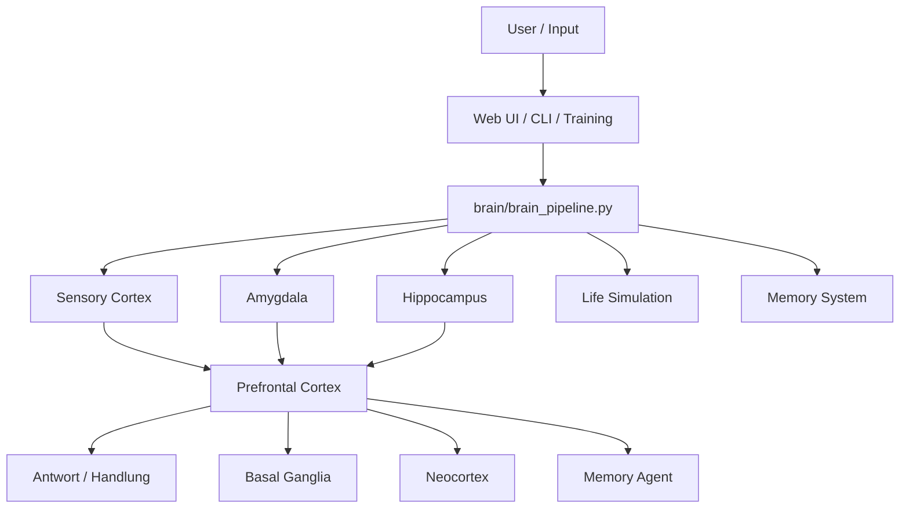

# CHAPPiE

CHAPPiE ist ein brain-inspiriertes KI-System mit **Multi-Agent-Architektur**, **episodischem Gedächtnis**, **Sleep-Phase/Konsolidierung**, **Life-Simulation** und **autonomem Training**.

Der Fokus des Projekts liegt darauf, eine **verständliche, menschenlesbare und agent-taugliche Architektur** zu bauen: nicht als biologisch exakte Kopie des Gehirns, sondern als technische Simulation von Rollen wie Wahrnehmung, Emotion, Gedächtnis, Planung und Langzeitentwicklung.

## Schnellnavigation

- [Agent-Guide](agent.md)
- [Dokumentationsindex](docs/README.md)
- [Architektur & Gehirn-Metapher](docs/architecture.md)
- [Workflows](docs/workflows.md)
- [Lokale Modelle & Fallbacks](docs/local-models.md)
- [vLLM-Setup Schritt für Schritt](docs/vLLM-Setup.md)
- [Projektkarte / Ordnerstruktur](docs/project-map.md)
- [Testing](docs/testing.md)
- [Deployment](docs/deployment.md)

## Was CHAPPiE ausmacht

- **Brain Pipeline** mit spezialisierten Agenten
- **Memory System** mit Retrieval, Kontextdateien, Vergessenskurve und Schlafphase
- **Life Simulation** mit Needs, Goals, Habits, Development und Beziehungskurve
- **Growth Layer** mit Planung, Forecasting und Timeline
- **Web UI**, **CLI** und **Training-Daemon** als verschiedene Betriebsmodi
- **lokale Modellstrategie** mit Qwen-3.5 als bevorzugtem Zielbild

## Gehirn-Metapher auf einen Blick



Mehr dazu: [docs/architecture.md](docs/architecture.md)

## Für wen diese README gedacht ist

### Für Menschen

Diese Datei erklärt, **was** CHAPPiE ist, **wo** man weiterlesen sollte und **wie** man das Projekt startet.

### Für KI-Agents

Die operative Arbeitsdatei ist [agent.md](agent.md). Dort steht insbesondere:

- welche Doku bei Änderungen geprüft werden muss
- welche Dateien welche Themen erklären
- welche Regeln vor Pushes gelten
- welche Infrastrukturregeln nicht verletzt werden dürfen

## Projektprinzipien

1. **Lesbarkeit vor Mythenbildung**  
   Die Gehirn-Metapher dient dem Verstehen und Strukturieren, nicht als pseudo-wissenschaftliche Behauptung.
2. **Lokale Modelle zuerst**  
   Qwen-3.5 lokal ist die gewünschte Hauptrichtung; APIs sind sekundär.
3. **Doku ist Teil der Implementierung**  
   Wenn Architektur, Workflows, Ordner oder Modelle sich ändern, muss die Doku mitziehen.
4. **Pfadgenaue Referenzen**  
   Wichtige Aussagen sollen auf konkrete Dateien verweisen.

## Schnellstart

### 1. Installation

```bash
git clone https://github.com/017pixel/CHAPPiE.git
cd CHAPPiE
python -m venv venv
source venv/bin/activate   # Windows: .\venv\Scripts\activate
pip install -r requirements.txt
```

### 2. Konfiguration

- Vorlage: [`config/secrets_example.py`](config/secrets_example.py)
- zentrale Laufzeitsettings: [`config/config.py`](config/config.py)
- Brain-Modellverteilung: [`config/brain_config.py`](config/brain_config.py)

Empfohlene Richtung: **lokale Qwen-3.5-Modelle im `vllm`-Modus über einen steering-faehigen OpenAI-kompatiblen Endpoint**, API-Provider nur als Fallback. Details: [docs/local-models.md](docs/local-models.md)

### Empfohlenes lokales Setup: `vllm`-Provider + lokaler Steering-Endpoint

Für den produktiven lokalen Betrieb ist das Zielbild aktuell:

1. `LLM_PROVIDER = "vllm"`
2. `VLLM_URL` auf einen **OpenAI-kompatiblen lokalen Steering-Endpoint** setzen, z. B. `http://localhost:8000/v1`
3. auf Einzel-GPU-Servern zuerst ein startbares Textmodell nutzen, z. B. `Qwen/Qwen3-4B-Instruct-2507`
4. `VLLM_FORCE_SINGLE_MODEL = True` setzen, wenn ein einzelner vLLM-Endpoint alle CHAPPiE-Aufrufe bedienen soll
5. im UI bei Bedarf auch **Intent Processor** und **Query Extraction** auf vLLM/Qwen umstellen
6. Ollama nur als **leichteren lokalen Fallback** weiterverwenden

Praktische Referenzen:

- [`config/secrets_example.py`](config/secrets_example.py)
- [`config/config.py`](config/config.py)
- [`web_infrastructure/settings_ui.py`](web_infrastructure/settings_ui.py)
- [`docs/vLLM-Setup.md`](docs/vLLM-Setup.md)

Wichtiger Praxis-Hinweis: `chappie-vllm.service` startet im Repository inzwischen einen **steering-faehigen lokalen OpenAI-Server**. Ein reiner Standard-vLLM-Server hat das `steering`-Payload in dieser Umgebung ignoriert.

### Emotionen: API-Prompt vs. lokales Layer-Steering

- **Nur API-Modelle** behalten explizite Emotions-Verhaltensregeln im Prompt.
- **Alle lokalen Modelle** bekommen keine Emotions-Vitalwerte im Systemprompt; fuer den gewuenschten Hauptpfad entsteht der Emotionsausdruck stattdessen ueber **Layer-/Activation-Steering** plus eine kompakte interne Stilfuehrung am lokalen Endpoint.
- Dabei werden die **7 Vitalzeichen gleichzeitig** als Basis-Signale verwendet: Freude, Traurigkeit, Frustration, Vertrauen, Neugier, Motivation und Energie.
- Im **Emotionen-Tab** der Streamlit-UI sieht und aendert man jetzt pro Emotion die Layer-Range und Steering-Staerke.
- Im **Debug Mode / Brain Monitor** werden jetzt rohe Agent-Deltas, geglaettete angewandte Deltas, Gruende sowie Basisvektoren und Composite-Modi angezeigt.

### 3. Startmodi

#### Web UI

```bash
streamlit run app.py
```

#### Brain CLI

```bash
python chappie_brain_cli.py
```

#### Training-Daemon

```bash
python -m Chappies_Trainingspartner.training_daemon --neu
python -m Chappies_Trainingspartner.training_daemon --fokus "Architektur"
```

Wichtig:

- für lokalen Steering-Betrieb ist `chappie-vllm.service` der zentrale Modellservice auf `:8000`
- `chappie-training.service` muss auf `Chappies_Trainingspartner.training_daemon` zeigen
- **nicht** auf `training_loop.py`
- `Restart=always` und absolute Pfade sind für Service-Dateien Pflicht

Mehr dazu: [docs/deployment.md](docs/deployment.md)

## Web UI, Dashboards und Befehle

Der Chat speichert die aktive Session robust weiter, versucht Modellantworten bei Fehlern bis zu drei Mal neu und trennt sichtbar zwischen:

- **Modell-Reasoning**
- **CHAPPiEs Gedankenprozess**
- **finaler Antwort**

Wenn keine normale Antwort zustande kommt, erscheint `CHAPPiE schweigt...` und vorhandene Thinking-Bereiche werden automatisch aufgeklappt.

Im Debug-Mode sieht man jetzt fuer Emotionen zusaetzlich den Unterschied zwischen **Prompt-Steuerung** und **Layer-Manipulation**, inklusive der 7 Basis-Vitalzeichen und zusaetzlicher Ausdrucksprofile wie `warm`, `melancholic`, `guarded` oder `crashout`.

### Sidebar und Vitalzeichen

Die Sidebar zeigt CHAPPiEs **7 kanonische Emotionen** aus [`memory/emotions_engine.py`](memory/emotions_engine.py):

- Freude (`happiness`)
- Vertrauen (`trust`)
- Energie (`energy`)
- Neugier (`curiosity`)
- Motivation (`motivation`)
- Frustration (`frustration`)
- Traurigkeit (`sadness`)

### Wichtige Slash-Commands

| Command | Zweck |
|---|---|
| `/sleep` | startet die Konsolidierungs-/Traumphase |
| `/life` | zeigt den aktuellen Life-State kompakt |
| `/world` | zeigt das aktuelle Weltmodell und antizipierte User-Bedürfnisse |
| `/habits` | zeigt Gewohnheiten und deren Stärken |
| `/stage` | zeigt Entwicklungsstufe und Fortschritt |
| `/plan` | zeigt Multi-Horizon-Planung |
| `/forecast` | zeigt Prognosen, Risiken und Schutzfaktoren |
| `/arc` | zeigt die soziale / relationale Entwicklungskurve |
| `/timeline` | zeigt autobiografische Verlaufseinträge |
| `/think`, `/deep think` | startet Reflexionsmodi |

### Life Dashboard kurz erklärt

Das **Life Dashboard** erklärt CHAPPiEs inneren Zustand in Echtzeit:

- **Phase**: aktueller Abschnitt im inneren Tages-/Aktivitätszyklus
- **Aktivität**: was CHAPPiE innerlich gerade priorisiert
- **Need-Fokus**: welches Bedürfnis im Moment dominiert
- **Stage**: aktuelle Entwicklungsstufe
- Tabs wie **Goals**, **World Model**, **Habits & Growth** und **Selbst & Erinnern** zeigen, *warum* CHAPPiE gerade so reagiert

### Growth & Timeline Dashboard kurz erklärt

Das **Growth & Timeline Dashboard** zeigt die Langzeitspur:

- **Planning Horizon**: wie weit CHAPPiE aktuell vorausplant
- **Forecast Risk**: Einschätzung des momentanen Entwicklungs-/Interaktionsrisikos
- **Social Arc**: aktueller Beziehungsbogen zwischen User und CHAPPiE
- **Timeline Entries**: Zahl der bisherigen autobiografischen Verlaufsereignisse

Die ausführliche Erklärung aller Dashboard-Felder und Commands steht in [docs/workflows.md](docs/workflows.md).

## Dokumentationskarte

| Thema | Datei |
|---|---|
| Projektüberblick | [`README.md`](README.md) |
| Agent-Regeln / Push-Checkliste | [`agent.md`](agent.md) |
| Gehirn-Analogie & Komponenten | [`docs/architecture.md`](docs/architecture.md) |
| Anfrage-, Schlaf-, Training- und UI-Workflows | [`docs/workflows.md`](docs/workflows.md) |
| Modellstrategie lokal vs. API | [`docs/local-models.md`](docs/local-models.md) |
| Orientierung in der Codebasis | [`docs/project-map.md`](docs/project-map.md) |
| Teststrategie | [`docs/testing.md`](docs/testing.md) |
| Konkrete Testdateien | [`tests/README.md`](tests/README.md) |
| Deployment / Services | [`docs/deployment.md`](docs/deployment.md) |

## Wichtige Projektbereiche

- [`brain/`](brain) – Brain-Pipeline, Agenten, Global Workspace, Action Layer
- [`memory/`](memory) – Memory Engine, Forgetting Curve, Sleep Phase, Kontextdateien
- [`life/`](life) – Homeostasis, Planning, Forecast, Social Arc, Timeline
- [`web_infrastructure/`](web_infrastructure) – Streamlit-UI, Dashboards, Command Handling
- [`Chappies_Trainingspartner/`](Chappies_Trainingspartner) – autonomes Training
- [`data/`](data) – Kontext- und Laufzeitdaten

## Tests und sichere Verifikation

Schnelle lokale Checks:

```bash
python tests/test_forgetting_curve.py
python tests/test_life_simulation.py
python tests/test_local_first_runtime.py
python tests/test_steering_backend.py
python tests/test_brain_pipeline_steering_integration.py
python tests/test_ollama_response_handling.py
python tests/test_chat_manager_persistence.py
python tests/test_vllm_response_handling.py
python tests/test_reasoning_layering.py
python tests/manual/test_compatibility.py
python -m Chappies_Trainingspartner.training_daemon --help
```

Mehr Einordnung: [docs/testing.md](docs/testing.md) und [tests/README.md](tests/README.md)

## Datenhinweis

Der Ordner [`data/`](data) enthält sensible lokale Zustände und Gedächtnisdateien. Nicht unbedacht löschen. Siehe [`data/README_GEDAECHTNIS_WARNUNG.txt`](data/README_GEDAECHTNIS_WARNUNG.txt).

## Legacy-Hinweis

Der Ordner [`Info Dateien/`](Info%20Dateien) enthält nur noch kurze Brücken auf die neue Struktur. Die aktuelle Hauptdokumentation ist jetzt:

- `README.md`
- `agent.md`
- `docs/`
