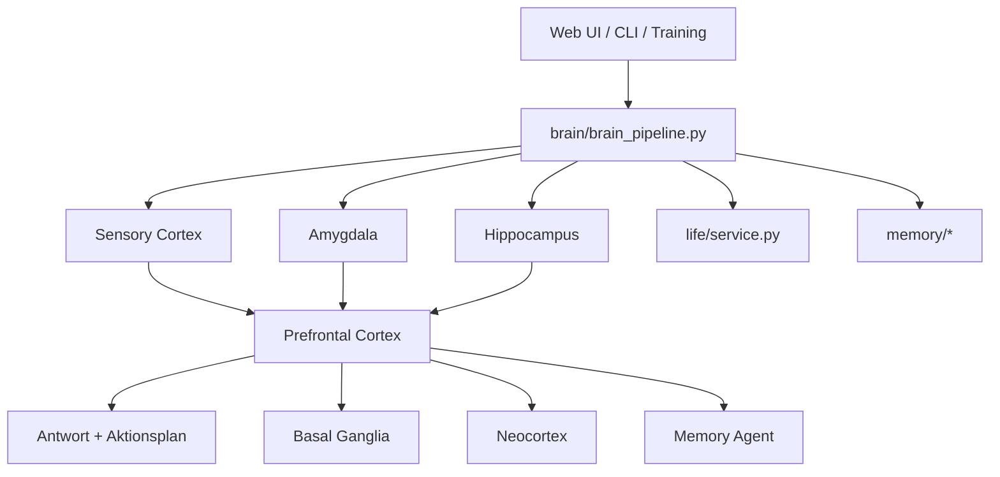

# Architektur und Gehirn-Metapher

## Zielbild

CHAPPiE ist kein neurologisch exaktes Gehirnmodell. Das Projekt nutzt stattdessen **eine verständliche, technische Analogie**: Aufgaben des menschlichen Gehirns werden auf spezialisierte Software-Komponenten und Agenten abgebildet.

## Was an der Metapher „echt menschlich“ ist

- **Sinnesverarbeitung:** Eingaben werden zuerst klassifiziert.
- **Emotionale Gewichtung:** Inhalte beeinflussen Priorität und Ton.
- **Gedächtnisarbeit:** Erinnern, Verdichten, Vergessen und Konsolidieren.
- **Planung:** Antworten werden nicht nur generiert, sondern strategisch vorbereitet.
- **Lernen über Zeit:** Schlafphase, Wiederholung, Gewohnheiten, Beziehungskurve.

## Was nur simuliert ist

- kein biologisches Nervensystem
- keine echte Neurochemie
- keine wissenschaftliche 1:1-Rekonstruktion des Gehirns
- sondern ein **mehrschichtiges KI-System mit klaren Rollen und Zuständen**

## Systemkarte

## Abbildung Gehirnregion → CHAPPiE-Komponente

| Gehirnidee | CHAPPiE-Komponente | Hauptdateien | Aufgabe |
|---|---|---|---|
| Sensorischer Cortex | Sensory Cortex Agent | `brain/agents/sensory_cortex.py` | Eingabe klassifizieren, Dringlichkeit schätzen |
| Amygdala | Amygdala Agent | `brain/agents/amygdala.py` | Emotionale Bewertung, Relevanz, Verstärkung |
| Hippocampus | Hippocampus Agent | `brain/agents/hippocampus.py` | Memory-Retrieval, Encoding, Kontextsuche |
| Präfrontaler Cortex | Prefrontal Cortex Agent | `brain/agents/prefrontal_cortex.py` | Strategie, Antwortführung, Priorisierung |
| Basalganglien | Basal Ganglia Agent | `brain/agents/basal_ganglia.py` | Reward, Lernsignal, Interaktionsbewertung |
| Neocortex | Neocortex Agent | `brain/agents/neocortex.py` | Langfristige Konsolidierung |
| Tool-/Meta-Ebene | Memory Agent | `brain/agents/memory_agent.py` | Entscheidungen zu `soul.md`, `user.md`, `CHAPPiEsPreferences.md` |

## Zentrale Integrationsschichten

| Schicht | Datei | Rolle |
|---|---|---|
| Brain Pipeline | `brain/brain_pipeline.py` | Verbindet Agenten, Memory und Life-Simulation |
| Global Workspace | `brain/global_workspace.py` | Bündelt priorisierte Signale für die Antwortphase |
| Action Response Layer | `brain/action_response.py` | Leitet aus Strategie konkrete Antwortaktionen ab |
| Lokaler Steering-Endpoint | `brain/steering_api_server.py`, `brain/steering_backend.py` | Setzt lokales OpenAI-kompatibles Serving, Activation-Steering und stilstabilisierte Antwortführung um |
| Life Simulation | `life/service.py` | Simuliert Bedürfnisse, Ziele, Entwicklung und Beziehung |
| Memory Engine | `memory/memory_engine.py` | Episodisches Gedächtnis und Suche |
| Sleep Phase | `memory/sleep_phase.py` | Konsolidierung, Replay, Schlaflogik |

## Life-Simulation als „inneres Leben"

Die Life-Simulation erweitert die Gehirn-Metapher um langfristige Zustände:

- **Homeostasis / Needs**
- **Goal Competition**
- **World Model**
- **Habit Dynamics**
- **Development Stage**
- **Attachment / Social Arc**
- **Timeline / autobiografische Entwicklung**

Relevante Dateien liegen unter [`life/`](../life).

## Source-of-Truth-Dateien für Architekturfragen

- [`brain/brain_pipeline.py`](../brain/brain_pipeline.py)
- [`brain/agents/`](../brain/agents)
- [`life/service.py`](../life/service.py)
- [`memory/sleep_phase.py`](../memory/sleep_phase.py)
- [`memory/forgetting_curve.py`](../memory/forgetting_curve.py)
- [`config/brain_config.py`](../config/brain_config.py)

## Weiterführend

- [Workflows](workflows.md)
- [Lokale Modelle & Fallbacks](local-models.md)
- [Projektkarte](project-map.md)

