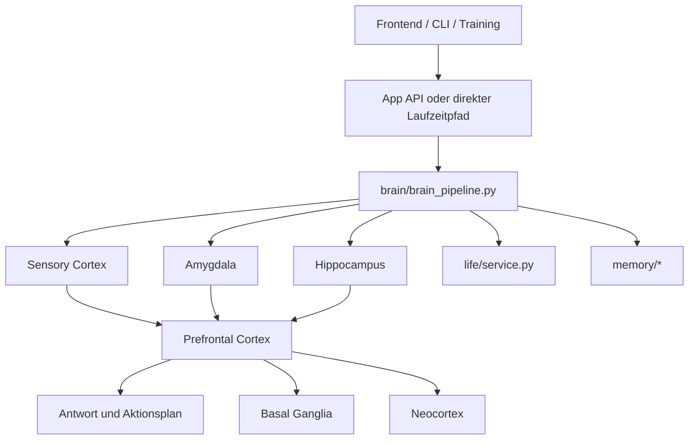

# Architektur und Gehirn-Metapher

## Zielbild

CHAPPiE ist kein neurologisch exaktes Gehirnmodell. Es nutzt eine technische Analogie: Wahrnehmung, Emotion, Gedaechtnis, Planung und Entwicklung werden auf klar getrennte Software-Komponenten abgebildet.

## Systemkarte

## Abbildung Gehirnidee zu CHAPPiE-Komponente

| Gehirnidee | CHAPPiE-Komponente | Hauptdateien | Aufgabe |
|---|---|---|---|
| Sensorischer Cortex | Sensory Cortex Agent | `brain/agents/sensory_cortex.py` | Eingabe klassifizieren |
| Amygdala | Amygdala Agent | `brain/agents/amygdala.py` | emotionale Gewichtung |
| Hippocampus | Hippocampus Agent | `brain/agents/hippocampus.py` | Retrieval und Encoding |
| Praefrontaler Cortex | Prefrontal Cortex Agent | `brain/agents/prefrontal_cortex.py` | Strategie und Antwortfuehrung |
| Basalganglien | Basal Ganglia Agent | `brain/agents/basal_ganglia.py` | Reward und Lernsignal |
| Neocortex | Neocortex Agent | `brain/agents/neocortex.py` | langfristige Konsolidierung |
| Tool- und Meta-Ebene | Memory Agent | `brain/agents/memory_agent.py` | Entscheidungen zu Kontextdateien |

## Zentrale Integrationsschichten

| Schicht | Datei | Rolle |
|---|---|---|
| Brain Pipeline | `brain/brain_pipeline.py` | verbindet Agenten, Memory und Life-Simulation |
| Global Workspace | `brain/global_workspace.py` | buendelt priorisierte Signale |
| Action Response Layer | `brain/action_response.py` | leitet konkrete Antwortaktionen ab |
| lokaler Steering-Endpoint | `brain/steering_api_server.py`, `brain/steering_backend.py` | OpenAI-kompatibles Serving und Steering |
| Life Simulation | `life/service.py` | Needs, Goals, Forecast und Beziehung |
| Memory Engine | `memory/memory_engine.py` | episodisches Gedaechtnis und Suche |
| Sleep Phase | `memory/sleep_phase.py` | Konsolidierung, Replay und Verdichtung |
| Web-Bruecke | `web_infrastructure/backend_wrapper.py` | UI-freie Laufzeitkopplung fuer API, CLI und Tests |

## Life-Simulation

Die Life-Simulation erweitert die Gehirn-Metapher um:

- Homeostasis und Needs
- Goal Competition
- World Model
- Habit Dynamics
- Development Stage
- Attachment und Social Arc
- Timeline und autobiografische Entwicklung

## Debug- und Entscheidungsspuren

Der Debug-Pfad macht die Ursache-Wirkung-Kette sichtbar:

- Input und Intent
- Memory-Treffer
- Emotionen und Deltas
- Life-Signale
- finale Ton- und Antwortentscheidung

Wichtige Pfade:

- `web_infrastructure/backend_wrapper.py`
- `api/routers/system.py`
- `memory/memory_engine.py`
- `memory/sleep_phase.py`

## Weiterfuehrend

- [Workflows](workflows.md)
- [Lokale Modelle](local-models.md)
- [Projektkarte](project-map.md)
