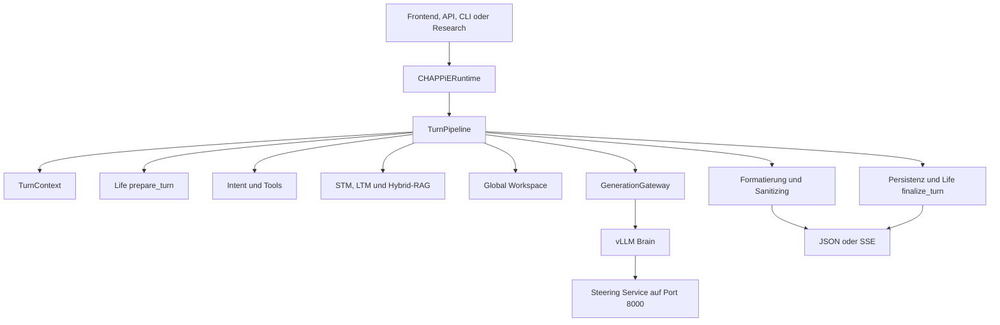

# Architektur

## Aktiver Requestpfad

```mermaid
flowchart TD
    E[Frontend, API, CLI oder Research] --> R[CHAPPiERuntime]
    R --> P[TurnPipeline]
    P --> C[TurnContext]
    P --> L[Life prepare_turn]
    P --> I[Intent und Tools]
    P --> M[STM, LTM und Hybrid-RAG]
    P --> W[Global Workspace]
    P --> G[GenerationGateway]
    G --> V[vLLM Brain]
    V --> S[Steering Service auf Port 8000]
    P --> F[Formatierung und Sanitizing]
    P --> X[Persistenz und Life finalize_turn]
    F --> O[JSON oder SSE]
    X --> O
```

`CHAPPiERuntime` ist die öffentliche Fassade. `process()` und `process_stream()` bauen denselben `TurnContext` und delegieren an dieselbe `TurnPipeline`. Nur die Ausgabeadapter unterscheiden sich.

## Verantwortungen

| Modul | Verantwortung | Relevante Seiteneffekte |
|---|---|---|
| `chappie_runtime.py` | Komponentenaufbau, Lifecycle, öffentliche API | Initialisierung lokaler Runtime-Verzeichnisse |
| `turn_pipeline.py` | Reihenfolge und gemeinsamer Turn-Kern | koordiniert Life, Memory und Abschluss |
| `turn_context.py` | reine Kontext- und Gate-Helfer | keine globalen Mutationen |
| `contracts.py` | typisierte interne Verträge | keine |
| `generation.py` | aktuelles Brain lazy auflösen und generieren | Provideraufruf |
| `formatting.py` | Parsing, Sanitizing, UI-Nachrichten | keine Persistenz |
| `persistence.py` | Chat-, STM- und Abschlusswrites | persistierte Laufzeitdaten |
| `backend_wrapper.py` | alte Imports und Factory-Namen | keine Fachlogik |

Die externen JSON- und SSE-Formen bleiben Dict-basierte Verträge am Rand. Interne Typen ändern diese Formen nicht.

## Brain, Steering, Memory und Life

Die Runtime orchestriert bestehende Subsysteme und dupliziert deren Fachlogik nicht:

- `brain/global_workspace.py` priorisiert aktive Signale.
- `brain/action_response.py` baut Aktions- und Prompt-Kontext.
- `brain/steering_manager.py` berechnet VAD-, Alpha- und Layer-Steuerung.
- `brain/steering_backend.py` injiziert Vektoren in unterstützte Modell-Layer.
- `memory/memory_engine.py` verwaltet episodische Suche und persistierte Memories.
- `memory/short_term_memory.py` verwaltet atomare STM-Daten.
- `memory/sleep_phase.py` steuert Replay und Konsolidierung.
- `life/service.py` stellt `prepare_turn`, `finalize_turn` und Snapshots bereit.

Persistierte Formate und Life-/Memory-Semantik wurden bei der Modularisierung nicht migriert.

## Emotion-Steering

Zehn Emotionen sind zentral in `config/emotions.py` definiert. Für den Qwen-3.5-4B-Standard verwendet das aktive Profil Layer 10 bis 26. vLLM transportiert Steering-Metadaten im OpenAI-kompatiblen Request; Ollama und Groq verwenden den inneren Zustand als Prompt-Kontext, wenn diese Adapter außerhalb des festen Webpfads eingesetzt werden.

Die Produktversion, die Steering-Service-Version und die Steering-Payload-Version sind getrennte Verträge und werden nicht pauschal synchronisiert.

## Historische BrainPipeline v1

Die frühere `BrainPipeline` mit Sensory Cortex, Amygdala, Hippocampus, Prefrontal Cortex, Basal Ganglia, Neocortex und Memory Agent war ein erster Architekturversuch. Sie ist kein produktiver Requestpfad.

- Originalquellen: `Legacy-Code/brain-pipeline-v1/`
- alter Importvertrag: `brain/brain_pipeline.py`
- historischer Agent-Pfad: `brain/agents/`, lazy und nicht vom Runtime-Import geladen
- aktiver Nachfolger: Runtime-Fassade und Turn-Pipeline

Der Kompatibilitätspfad lädt die v1-Quelle nur bei einem ausdrücklichen historischen Import. Details stehen in [Legacy-Code](../Legacy-Code/README.md).

## Konfigurations-Sideeffects

`config/config.py` erzeugt beim Import weiterhin `data/`, `data/chroma_db/` und `data/research_runs/`. Das Verhalten bleibt aus Kompatibilitätsgründen bestehen, weil mehrere Entrypoints und Tests die Verzeichnisse voraussetzen. Neue Tests sollen für zustandsbehaftete Komponenten explizite temporäre Runtime-Verzeichnisse übergeben. Eine Entfernung dieses Sideeffects wäre eine eigene Migration.

Weiterführend: [Laufzeitverträge](runtime-contracts.md), [Workflows](workflows.md), [Cleanup-Entscheidungen](repository-cleanup.md).
