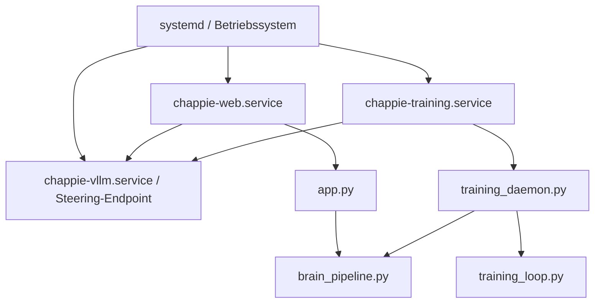

# Deployment und Serverbetrieb

## Ziel

Diese Seite bündelt den produktionsnahen Betrieb von CHAPPiE für Web-App und Trainingsprozess.

## Wichtige Service-Regeln

### Training-Service

Die Datei [`chappie-training.service`](../chappie-training.service) muss für den Hintergrundbetrieb auf **`training_daemon.py`** zeigen:

- korrekt: `-m Chappies_Trainingspartner.training_daemon`
- falsch: `-m Chappies_Trainingspartner.training_loop`

### Zuverlässigkeit

- `Restart=always` verwenden
- absolute Pfade in `ExecStart` und `WorkingDirectory`
- Logs über `journalctl` prüfen

## Services im Repository

| Datei | Zweck |
|---|---|
| `chappie-vllm.service` | steering-faehiger lokaler OpenAI-kompatibler Modellserver auf `:8000` |
| `chappie-training.service` | Hintergrund-Training / Lernprozess |
| `chappie-web.service` | Streamlit-Weboberfläche |
| `deploy_training.sh` | Linux-Setup / Deployment-Helfer |
| `deploy_training.bat` | Windows-Helfer |

## Betriebsbild

## Deployment-Checkliste

1. Python-Umgebung vorhanden
2. lokale Modell- oder API-Konfiguration gesetzt
3. Kontextdateien in `data/` gesichert
4. `chappie-training.service` auf `training_daemon.py` geprüft
5. `Restart=always` und absolute Pfade geprüft
6. Steering-, Web- und Training-Service separat getestet
7. relevante Doku aktualisiert (`README.md`, `agent.md`, `docs/*`)

## Steering-Service konkret

- `chappie-vllm.service` ist der historische Dateiname, startet aber jetzt den steering-faehigen lokalen OpenAI-Server aus `brain/steering_api_server.py`
- `LLM_PROVIDER = "vllm"` bleibt bewusst erhalten, weil CHAPPiE weiterhin ueber das OpenAI-kompatible Endpoint-Schema auf `http://localhost:8000/v1` spricht
- Web UI, CLI und Training muessen alle auf denselben Endpoint zeigen, damit Steering, Debugdaten und Single-Model-Routing konsistent bleiben

## GitHub Actions: nur CI / Tests

GitHub Actions wird in diesem Repository nur für automatische Tests genutzt.

- `.github/workflows/ci.yml` führt automatische Push-/PR-Checks aus.
- Server-Deployments laufen **nicht** über GitHub Actions.

Produktions- oder Server-Updates müssen bewusst manuell auf dem Zielsystem durchgeführt werden, nachdem die CI grün ist.

## Server-Kommandos

Die frühere SSH-Sammlung wurde inhaltlich in diese Seite überführt. Für den Alltag sind typischerweise relevant:

- Service-Status prüfen
- Logs lesen
- Service neu starten
- Arbeitsverzeichnis und Pfade validieren

## Achtung bei Änderungen

Änderungen an diesen Bereichen brauchen fast immer Doku-Abgleich:

- `app.py`
- `Chappies_Trainingspartner/*`
- `chappie-*.service`
- `deploy_training.*`
- `config/*`

## Weiterführend

- [Workflows](workflows.md)
- [Lokale Modelle & Fallbacks](local-models.md)
- [Projektkarte](project-map.md)

## Training-UI Steuerung

Die Web-UI steuert Training weiterhin subprocess-basiert, nicht ueber systemd-API-Aufrufe:

- Start/Stop/Restart laufen ueber `Chappies_Trainingspartner/daemon_manager.py`
- Prozesszustand wird ueber `training.pid` plus Heartbeat in `training_state.json` bewertet
- Der Daemon gilt nur dann als gesund, wenn Prozess und aktuelle Aktivitaet zusammenpassen
