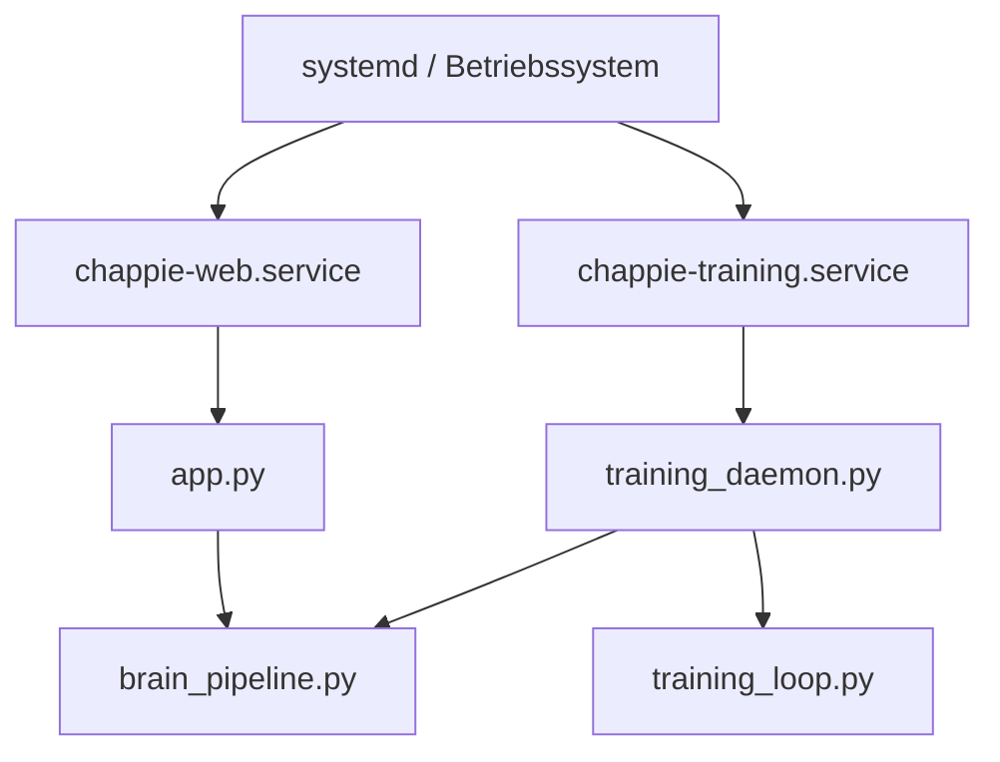

# Deployment und Serverbetrieb

## Ziel

Diese Seite bündelt den produktionsnahen Betrieb von CHAPPiE für Web-App und Trainingsprozess.

## Wichtige Service-Regeln

### Training-Service

Die Datei [`chappie-training.service`](../chappie-training.service) muss für den Hintergrundbetrieb auf **`training_daemon.py`** zeigen:

- korrekt: `-m Chappies_Trainingspartner.training_daemon`
- falsch: `-m Chappies_Trainingspartner.training_loop`

### Zuverlässigkeit

- `Restart=always` verwenden
- absolute Pfade in `ExecStart` und `WorkingDirectory`
- Logs über `journalctl` prüfen

## Services im Repository

| Datei | Zweck |
|---|---|
| `chappie-training.service` | Hintergrund-Training / Lernprozess |
| `chappie-web.service` | Streamlit-Weboberfläche |
| `deploy_training.sh` | Linux-Setup / Deployment-Helfer |
| `deploy_training.bat` | Windows-Helfer |

## Betriebsbild

## Deployment-Checkliste

1. Python-Umgebung vorhanden
2. lokale Modell- oder API-Konfiguration gesetzt
3. Kontextdateien in `data/` gesichert
4. `chappie-training.service` auf `training_daemon.py` geprüft
5. `Restart=always` und absolute Pfade geprüft
6. Web- und Training-Service separat getestet
7. relevante Doku aktualisiert (`README.md`, `agent.md`, `docs/*`)

## GitHub Actions: CI vs. Deploy

- `.github/workflows/ci.yml` führt automatische Push-/PR-Checks aus und ist die primäre Statusanzeige für funktionale Regressionen.
- `.github/workflows/deploy.yml` ist absichtlich als `workflow_dispatch` eingerichtet, damit ein instabiler SSH-Zugriff auf den Server nicht jeden Push rot markiert.

Wenn GitHub Actions direkt auf den Server deployen soll, müssen mindestens diese Voraussetzungen erfüllt sein:

1. `SERVER_HOST`, `SERVER_USER` und `SERVER_SSH_KEY` sind korrekt in GitHub Secrets hinterlegt.
2. Der SSH-Key ist gültig formatiert.
3. Der Server ist von GitHub-hosted Runnern aus auf Port 22 erreichbar.
4. Der Zielpfad, das virtuelle Environment und der systemd-Service existieren auf dem Server wie im Workflow hinterlegt.

## Server-Kommandos

Die frühere SSH-Sammlung wurde inhaltlich in diese Seite überführt. Für den Alltag sind typischerweise relevant:

- Service-Status prüfen
- Logs lesen
- Service neu starten
- Arbeitsverzeichnis und Pfade validieren

## Achtung bei Änderungen

Änderungen an diesen Bereichen brauchen fast immer Doku-Abgleich:

- `app.py`
- `Chappies_Trainingspartner/*`
- `chappie-*.service`
- `deploy_training.*`
- `config/*`

## Weiterführend

- [Workflows](workflows.md)
- [Lokale Modelle & Fallbacks](local-models.md)
- [Projektkarte](project-map.md)

