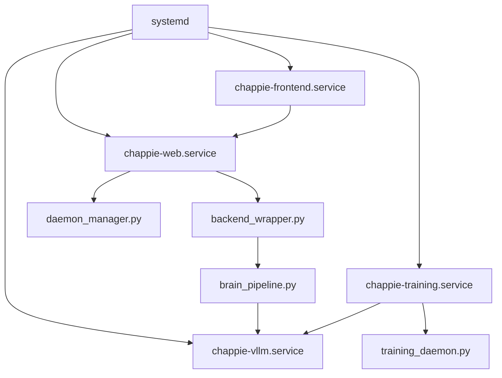

# Deployment und Serverbetrieb

## Ziel

Diese Seite beschreibt den produktiven Betrieb von CHAPPiE mit lokalem Modellservice, App-API, Frontend und Training.

## Wichtige Service-Regeln

### Training-Service

`chappie-training.service` muss auf `-m Chappies_Trainingspartner.training_daemon` zeigen.

- korrekt: `ExecStart=... -m Chappies_Trainingspartner.training_daemon`
- falsch: `ExecStart=... -m Chappies_Trainingspartner.training_loop`

### Zuverlaessigkeit

- `Restart=always` beibehalten
- absolute Pfade in `ExecStart` und `WorkingDirectory`
- Logs ueber `journalctl` pruefen

## Services im Repository

| Datei | Zweck |
|---|---|
| `chappie-vllm.service` | steering-faehiger lokaler OpenAI-kompatibler Modellserver auf `:8000` |
| `chappie-training.service` | Hintergrund-Training |
| `chappie-web.service` | FastAPI-App auf `:8010` |
| `chappie-frontend.service` | React-Frontend im Preview-Betrieb auf `:4173` |
| `deploy_training.sh` | Linux-Deployment-Helfer fuer alle Services |
| `deploy_training.bat` | Windows-Helfer |

## Frontend zu API

- das React-Frontend darf `VITE_API_BASE_URL` leer lassen und leitet dann automatisch auf den aktuellen Host mit Port `8010`
- fuer Reverse-Proxy- oder HTTPS-Setups sollte `VITE_API_BASE_URL` explizit auf den produktiven API-Ursprung gesetzt werden
- fuer getrennten Frontend-Betrieb kann `CHAPPIE_CORS_ORIGINS` als kommagetrennte Liste zusaetzlicher Origins gesetzt werden

## Betriebsbild

## Deployment-Checkliste

1. Python-Umgebung vorhanden
2. Frontend-Dependencies installiert oder Build erzeugt
3. lokale Modell- oder API-Konfiguration gesetzt
4. `data/` gesichert
5. `chappie-training.service` auf `training_daemon` geprueft
6. `Restart=always` und absolute Pfade geprueft
7. `chappie-vllm.service`, `chappie-web.service`, `chappie-frontend.service` und `chappie-training.service` separat getestet
8. auf dem Server ist das Steering-Modell bewusst auf `Qwen/Qwen3.5-9B` gesetzt, waehrend lokale Defaults schlank bleiben
9. relevante Doku aktualisiert

## Server-Kommandos

Direkt lokal:

- `python -m uvicorn api.main:app --host 0.0.0.0 --port 8010`
- `cd frontend && npm run dev`
- `python -m Chappies_Trainingspartner.training_daemon --neu`

Per Deployment-Skript:

- `./deploy_training.sh install-service`
- `./deploy_training.sh service-start`
- `./deploy_training.sh service-status`
- `./deploy_training.sh tail-web`
- `./deploy_training.sh tail-frontend`
- `./deploy_training.sh tail-vllm`

## GitHub Actions

`.github/workflows/ci.yml` prueft nur Tests und Builds. Server-Deployments laufen bewusst nicht ueber GitHub Actions.

## Aenderungen mit Doku-Pflicht

Fast immer pruefen bei Aenderungen an:

- `app.py`
- `api/*`
- `frontend/*`
- `Chappies_Trainingspartner/*`
- `chappie-*.service`
- `deploy_training.*`
- `config/*`

## Weiterfuehrend

- [Workflows](workflows.md)
- [Lokale Modelle](local-models.md)
- [Projektkarte](project-map.md)
