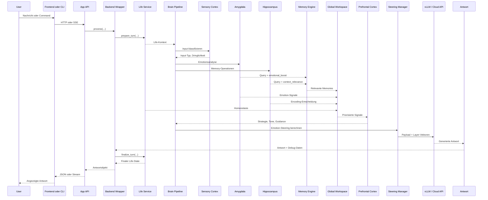
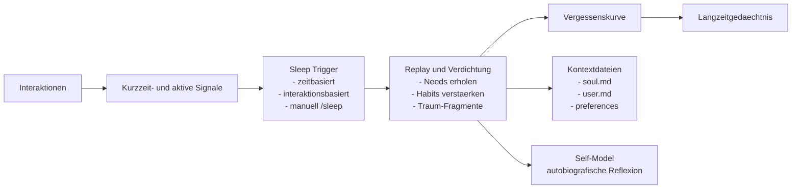
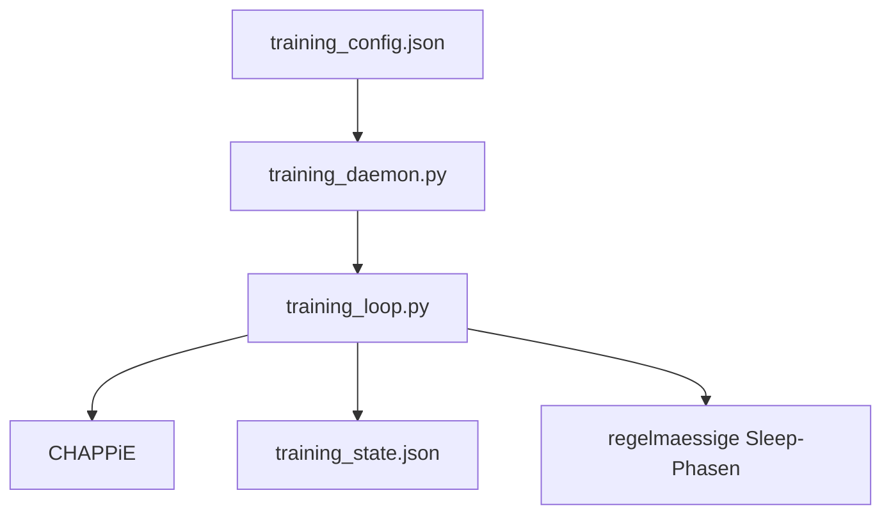

# Workflows

## 1. Anfrage-Workflow zur Laufzeit

## 2. Was technisch passiert

1. Frontend oder CLI nimmt Eingabe entgegen.
2. Die App-API routet nach Chat, Runtime, Memory, Context oder Training.
3. `web_infrastructure/backend_wrapper.py` kapselt die Fachlogik.
4. `life/service.py` berechnet `prepare_turn`: Uhrzeit, Baseline-Decay, Aktivitaet, Homeostasis.
5. `brain/brain_pipeline.py` orchestriert:
   - Sensory Cortex: Input-Klassifikation (Typ, Dringlichkeit, Memory-Bedarf)
   - Amygdala: Emotionsanalyse (7 Emotionen, Intensity, memory_boost, steering_hints)
   - Hippocampus: Memory-Operationen (Encoding, Query-Extraktion, Context-Relevanz)
   - Memory Engine: Episodische Suche mit optimierter Query
   - Global Workspace: 7 Signale mit Salience bundeln und priorisieren
   - Prefrontal Cortex: Response-Strategie, Tone, Guidance, Planning-Mode
   - Action Response Layer: prompt_suffix und action_plan bauen
   - Steering Manager: VAD-Mapping, Alpha, Composite Modes, Layer-Profile
6. Antwortgenerierung: 1x LLM-Call mit komplettem Kontext (Prompt + Steering-Payload)
7. `life/service.py` berechnet `finalize_turn`: Goal-Progress, Relationship, Habits, Attachment, Self-Model, Timeline.
8. Antwort, Debugdaten und Session-Zustand gehen an API und Frontend zurueck.

## 3. Schlafphase und Konsolidierung

Trigger:

- zeitbasiert
- interaktionsbasiert
- manuell ueber `/sleep`

Relevante Dateien:

- `memory/sleep_phase.py`
- `memory/forgetting_curve.py`
- `config/brain_config.py`

## 4. Trainings-Workflow

Wichtige Punkte:

- `training_daemon.py` ist der Service-Entry-Point
- `training_loop.py` ist kein systemd-Entry-Point
- API und Frontend steuern Training ueber `Chappies_Trainingspartner/daemon_manager.py`

## 5. Web-Workflow

Der produktive Webpfad ist jetzt:

1. React-Frontend in [`frontend/`](../frontend)
2. FastAPI in [`api/`](../api)
3. Fachlogik in [`web_infrastructure/backend_wrapper.py`](../web_infrastructure/backend_wrapper.py)
4. Session-Persistenz in [`memory/chat_manager.py`](../memory/chat_manager.py)

Wichtig:

- Frontend spricht nur mit der App-API
- die API spricht nie direkt mit einem UI-spezifischen State
- Streaming laeuft ueber `POST /chat/stream` mit echten Token-Events
- Slash-Commands werden serverseitig ueber `api/services/command_service.py` behandelt

### Chat-Streaming

Der Chat unterstuetzt jetzt Token-Level Streaming:

1. User sendet Nachricht -> Eingabefeld wird sofort geleert, Nachricht erscheint sofort im Chat (Optimistic UI)
2. Waehrend CHAPPiE denkt, zeigt eine pulsierende "Denk-Bubble" rotierende Status-Saetze an
3. Sobald das erste Token generiert wird, erscheint die Antwort live Wort fuer Wort in der UI
4. Neue Nachrichten koennen waehrend des Streamings eingegeben werden und landen in einer Queue
5. Nach Abschluss einer Antwort wird automatisch die naechste Nachricht aus der Queue abgeschickt

Relevante Dateien:

- `frontend/src/pages/chat-page.tsx` – Chat UI mit Queue, Thinking-Animation, Token-Streaming
- `frontend/src/services/api.ts` – SSE Streaming Client
- `api/routers/chat.py` – `/chat/stream` Endpoint mit Token-Events
- `web_infrastructure/backend_wrapper.py` – `process_stream()` fuer Token-Level Generierung

## 6. Debug, Memory und Runtime

Der Debug-Pfad zeigt die Kette hinter einer Antwort:

- Input und Intent
- Memory-Treffer und Merge
- Emotionen und Deltas
- Life- und Forecast-Signale
- finale Ton- und Antwortentscheidung

Wichtige Pfade:

- `api/routers/system.py`
- `api/routers/chat.py`
- `api/services/text_formatting.py`
- `web_infrastructure/backend_wrapper.py`

## 7. Wichtige Commands

| Command | Bedeutung |
|---|---|
| `/sleep` | startet die Schlaf- und Konsolidierungsphase |
| `/think [thema]` | startet einen Reflexionszyklus |
| `/deep think` | startet rekursive Selbstreflexion |
| `/help` | Command-Hilfe |
| `/stats` | Modell-, Memory- und Emotionsstatus |
| `/config` | Runtime-Settings anzeigen |
| `/clear` | startet einen frischen Chat |
| `/life` | kompakter Life-State |
| `/world` | Weltmodell |
| `/habits` | Gewohnheiten |
| `/stage` | Entwicklungsstufe |
| `/plan` | Planung |
| `/forecast` | Prognosen und Risiken |
| `/arc` | Social Arc |
| `/timeline` | autobiografische Verlaufseintraege |

## 8. Frontend-Seiten

Das Frontend bildet die frueheren Ansichten jetzt ueber eigene Seiten ab:

| Seite | Beschreibung |
|---|---|
| **Chat** | Chat-Interface mit Token-Level Streaming, Message Queue, Thinking-Animation und Optimistic UI |
| **Context** | Kontextdateien und System-Kontext |
| **Memories** | Episodisches Gedaechtnis durchsuchen |
| **Life** | Life-Simulation Status, Needs, Goals |
| **Growth** | Entwicklung und Lernfortschritt |
| **Settings** | Runtime-Konfiguration |
| **Training** | Trainings-Status und Steuerung |
| **Debug** | Debug-Logs und Causal Trace |
| **Visualizer** | 3D Emotion Lattice – lebendiger Orb mit Vertex Displacement und Partikeln |

Relevante Pfade:

- `frontend/src/router.tsx`
- `frontend/src/pages/*.tsx`
- `frontend/src/services/api.ts`
- `frontend/src/components/visualizer-canvas.tsx`

## Weiterfuehrend

- [Architektur](architecture.md)
- [Testing](testing.md)
- [Deployment](deployment.md)
