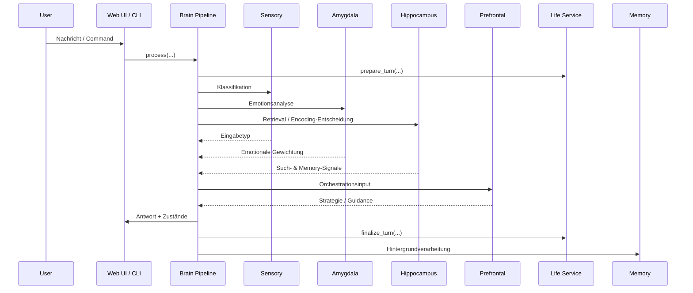
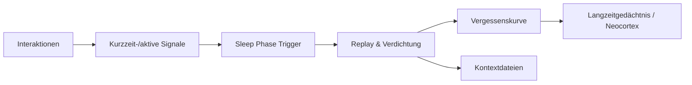
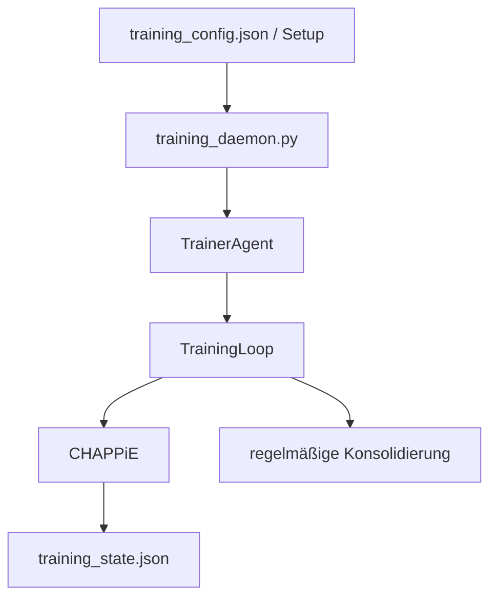

# Workflows

## 1. Anfrage-Workflow zur Laufzeit

## 2. Was dabei technisch passiert

1. **Interface nimmt Eingabe entgegen**  
   Dateien: `app.py`, `chappie_brain_cli.py`, `web_infrastructure/command_handler.py`
2. **Brain Pipeline baut Kontext zusammen**  
   Datei: `brain/brain_pipeline.py`
3. **Life Service liefert inneren Zustand**  
   Datei: `life/service.py`
4. **Sensory / Amygdala / Hippocampus arbeiten vor**
5. **Prefrontal Cortex bestimmt Antwortstrategie**
6. **Action Layer ergänzt Handlungsempfehlungen**
7. **Antwort geht zurück an UI oder CLI**
8. **Hintergrundarbeit speichert, bewertet und konsolidiert**

## 3. Schlafphase / Konsolidierung

### Trigger der Schlafphase

- zeitbasiert: alle **24 Stunden**
- interaktionsbasiert: alle **100 Interaktionen**
- manuell: Command **`/sleep`**

Quelle:
- `memory/sleep_phase.py`
- `config/brain_config.py`

## 4. Trainings-Workflow

### Wichtige Punkte

- Der **Service-Entry-Point ist `training_daemon.py`**.
- `training_loop.py` ist **kein** systemd-Entry-Point.
- Trainingslogik liegt unter [`Chappies_Trainingspartner/`](../Chappies_Trainingspartner).

## 5. Web-UI-Workflow

Datei [`app.py`](../app.py) routet zwischen:

- Chat
- Einstellungen
- Memories
- Training UI
- Life Dashboard
- Growth Dashboard

Die UI-Komponenten liegen unter [`web_infrastructure/`](../web_infrastructure).

## 6. Wichtige Commands

### Web / Chat

- `/sleep`, `/think`, `/deep think`, `/help`, `/stats`, `/config`
- `/daily`, `/personality`, `/consolidate`, `/reflect`, `/functions`
- `/life`, `/needs`, `/goals`, `/world`, `/habits`, `/stage`
- `/plan`, `/forecast`, `/arc`, `/timeline`
- `/soul`, `/user`, `/prefs`

### CLI

- `/status`, `/sleep`, `/life`, `/world`, `/habits`
- `/stage`, `/plan`, `/forecast`, `/arc`, `/timeline`
- `/vectors`, `/help`, `/exit`

## Weiterführend

- [Architektur](architecture.md)
- [Testing](testing.md)
- [Deployment](deployment.md)

