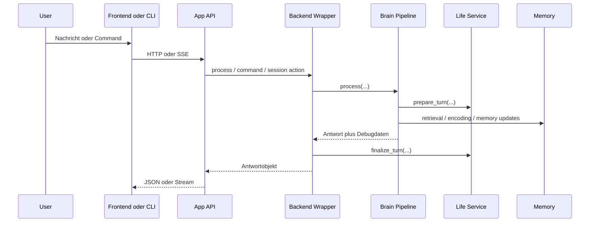
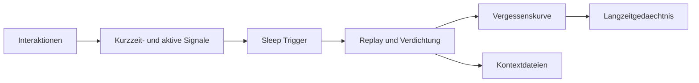
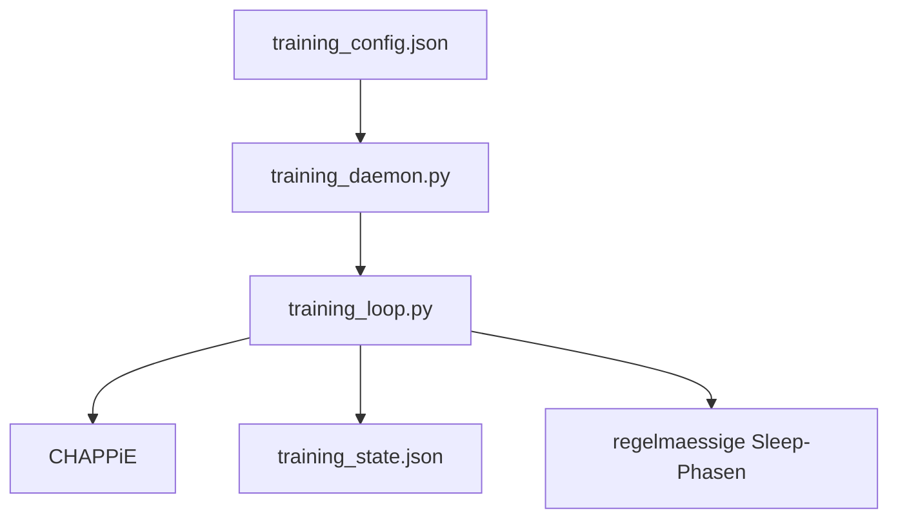

# Workflows

## 1. Anfrage-Workflow zur Laufzeit

## 2. Was technisch passiert

1. Frontend oder CLI nimmt Eingabe entgegen.
2. Die App-API routet nach Chat, Runtime, Memory, Context oder Training.
3. `web_infrastructure/backend_wrapper.py` kapselt die Fachlogik.
4. `brain/brain_pipeline.py` orchestriert Sensory, Amygdala, Hippocampus und Prefrontal.
5. `life/service.py` liefert inneren Zustand und Forecast-Signale.
6. `memory/*` liefert Retrieval, Persistenz und Konsolidierung.
7. Antwort, Debugdaten und Session-Zustand gehen an API und Frontend zurueck.

## 3. Schlafphase und Konsolidierung

Trigger:

- zeitbasiert
- interaktionsbasiert
- manuell ueber `/sleep`

Relevante Dateien:

- `memory/sleep_phase.py`
- `memory/forgetting_curve.py`
- `config/brain_config.py`

## 4. Trainings-Workflow

Wichtige Punkte:

- `training_daemon.py` ist der Service-Entry-Point
- `training_loop.py` ist kein systemd-Entry-Point
- API und Frontend steuern Training ueber `Chappies_Trainingspartner/daemon_manager.py`

## 5. Web-Workflow

Der produktive Webpfad ist jetzt:

1. React-Frontend in [`frontend/`](../frontend)
2. FastAPI in [`api/`](../api)
3. Fachlogik in [`web_infrastructure/backend_wrapper.py`](../web_infrastructure/backend_wrapper.py)
4. Session-Persistenz in [`memory/chat_manager.py`](../memory/chat_manager.py)

Wichtig:

- Frontend spricht nur mit der App-API
- die API spricht nie direkt mit einem UI-spezifischen State
- Streaming laeuft ueber `POST /chat/stream`
- Slash-Commands werden serverseitig ueber `api/services/command_service.py` behandelt

## 6. Debug, Memory und Runtime

Der Debug-Pfad zeigt die Kette hinter einer Antwort:

- Input und Intent
- Memory-Treffer und Merge
- Emotionen und Deltas
- Life- und Forecast-Signale
- finale Ton- und Antwortentscheidung

Wichtige Pfade:

- `api/routers/system.py`
- `api/routers/chat.py`
- `api/services/text_formatting.py`
- `web_infrastructure/backend_wrapper.py`

## 7. Wichtige Commands

| Command | Bedeutung |
|---|---|
| `/sleep` | startet die Schlaf- und Konsolidierungsphase |
| `/think [thema]` | startet einen Reflexionszyklus |
| `/deep think` | startet rekursive Selbstreflexion |
| `/help` | Command-Hilfe |
| `/stats` | Modell-, Memory- und Emotionsstatus |
| `/config` | Runtime-Settings anzeigen |
| `/clear` | startet einen frischen Chat |
| `/life` | kompakter Life-State |
| `/world` | Weltmodell |
| `/habits` | Gewohnheiten |
| `/stage` | Entwicklungsstufe |
| `/plan` | Planung |
| `/forecast` | Prognosen und Risiken |
| `/arc` | Social Arc |
| `/timeline` | autobiografische Verlaufseintraege |

## 8. Frontend-Seiten

Das Frontend bildet die frueheren Ansichten jetzt ueber eigene Seiten ab:

- Chat
- Context
- Memories
- Life
- Growth
- Settings
- Training
- Debug
- Visualizer

Relevante Pfade:

- `frontend/src/router.tsx`
- `frontend/src/pages/*.tsx`
- `frontend/src/services/api.ts`

## Weiterfuehrend

- [Architektur](architecture.md)
- [Testing](testing.md)
- [Deployment](deployment.md)
