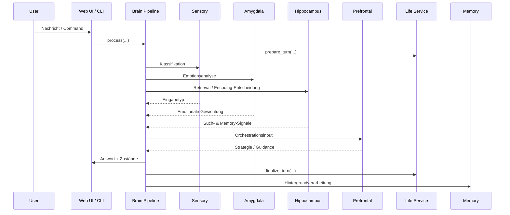
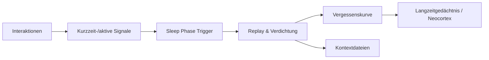
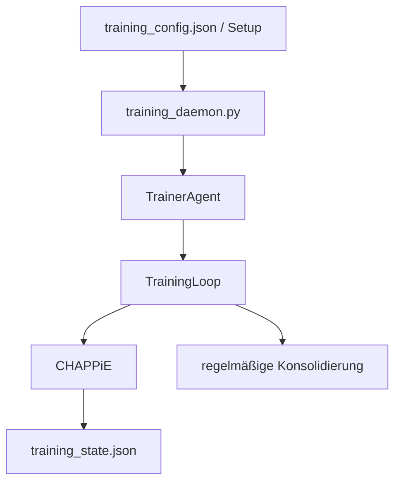

# Workflows

## 1. Anfrage-Workflow zur Laufzeit

## 2. Was dabei technisch passiert

1. **Interface nimmt Eingabe entgegen**  
   Dateien: `app.py`, `chappie_brain_cli.py`, `web_infrastructure/command_handler.py`
2. **Brain Pipeline baut Kontext zusammen**  
   Datei: `brain/brain_pipeline.py`
3. **Life Service liefert inneren Zustand**  
   Datei: `life/service.py`
4. **Sensory / Amygdala / Hippocampus arbeiten vor**
5. **Prefrontal Cortex bestimmt Antwortstrategie**
6. **Action Layer ergänzt Handlungsempfehlungen**
7. **Antwort geht zurück an UI oder CLI**
8. **Hintergrundarbeit speichert, bewertet und konsolidiert**

## 3. Schlafphase / Konsolidierung

### Trigger der Schlafphase

- zeitbasiert: alle **24 Stunden**
- interaktionsbasiert: alle **25 Interaktionen**
- manuell: Command **`/sleep`**
- im Web-Chat wird die Schlafphase nach Erreichen des Intervalls im Hintergrund gestartet, inklusive Kontextdatei-Pflege

Quelle:
- `memory/sleep_phase.py`
- `config/brain_config.py`

## 4. Trainings-Workflow

### Wichtige Punkte

- Der **Service-Entry-Point ist `training_daemon.py`**.
- `training_loop.py` ist **kein** systemd-Entry-Point.
- Trainingslogik liegt unter [`Chappies_Trainingspartner/`](../Chappies_Trainingspartner).
- `training_config.json` enthält Persona, Curriculum, Sleep-Intervall und Laufzeitparameter für den 24/7-Betrieb.
- `training_loop.py` führt regelmäßige Sleep-/Traumzyklen aus und schreibt erweiterten Heartbeat / Topic-Fortschritt in `training_state.json`.

## 5. Web-UI-Workflow

Datei [`app.py`](../app.py) routet zwischen:

- Chat
- Einstellungen
- Memories
- Training UI
- Life Dashboard
- Growth Dashboard

Der Chat-Flow stellt die zuletzt aktive Session automatisch wieder her. Laufende Antworten werden zuerst als pending gespeichert und können im Hintergrund weiterlaufen, sodass ein kurzes Schließen/Neuladen der UI den Chat nicht mehr verwerfen soll.

Die Chat-Pipeline pflegt außerdem die Kontextdateien `soul.md`, `user.md` und `CHAPPiEsPreferences.md` an zwei Stellen:

- direkt über Tool-Calls wie `update_soul`, `update_user_profile` und `update_preferences`
- indirekt über die Schlafphase, die Replay-/Life-Snapshot-Daten in diese Dateien verdichtet

Im Chat werden Antwortschichten getrennt behandelt:

- **Modell-Reasoning**: echtes Provider-/Modell-Denken, z. B. von Qwen über Ollama oder den lokalen steering-faehigen `vllm`-Endpoint
- **CHAPPiEs Gedankenprozess**: interne `<thinking>` / `<gedanke>`-Tags
- **Antwort**: finaler sichtbarer Antworttext

Wenn keine finale Antwort vorliegt, wird stattdessen `CHAPPiE schweigt...` angezeigt und die vorhandenen Thinking-Bereiche werden automatisch aufgeklappt.

Fuer Emotionen gilt ausserdem:

- **Nur API-Modelle** bekommen explizite Emotionsregeln ueber den Prompt.
- **Lokales Qwen 3.5 im `vllm`-Modus** soll Emotionen primär ueber Layer-/Activation-Steering ausdruecken; der lokale Endpoint stabilisiert das Verhalten zusaetzlich ueber eine interne Stilvorgabe.
- Der **Emotionen-Tab** der Streamlit-UI erlaubt jetzt das direkte Einsehen und Aendern der Layer-Range sowie der Steering-Staerke pro Basis-Emotion.
- Feste Stilvorgaben wie dauerhaft `friendly` werden im lokalen Qwen-Pfad reduziert, damit die Layer-Manipulation wirklich durchkommt.

Die UI-Komponenten liegen unter [`web_infrastructure/`](../web_infrastructure).

### Debug Mode / Brain Monitor

Im **DEBUG MODE: ON** zeigt der aufklappbare **Brain Monitor** die Laufzeitpipeline in Phasen:

1. Input + Intent (inkl. Step-1-Roh-JSON)
2. Tool-Orchestrierung (verfügbar, ausgewählt, nicht genutzt, ausgeführt)
3. Emotionen + Homeostasis (Before/After/Raw Delta/Applied Delta + Anpassungen)
4. Layer-Pipeline (Goal, World Model, Planning, Forecast, Social Arc, Attachment, Development, Emotion-Steering)
5. Antwortgenerierung (Modell-Reasoning + CHAPPiE-Thought + Action Plan)
6. Event-Log (strukturierte Debug-Einträge pro Schritt)

Zusätzlich enthält der Global Workspace eine `math_trace`-Spur mit den Salience-Berechnungen je Layerquelle. Im Emotion-Steering-Bereich sieht man ausserdem Prompt-Modus, aktive Vektoren, Composite-Modi, Basis-Konfigurationen pro Emotion und den erwartbaren Ausdruck des Zustands. In Phase 3 werden rohe und geglaettete Deltas getrennt dargestellt.

## 6. Wichtige Commands

### Web / Chat: System, Memory und Reflexion

| Command | Bedeutung |
|---|---|
| `/sleep` | startet die Schlaf-/Konsolidierungsphase |
| `/think [thema]` | startet einen einfachen Reflexionszyklus |
| `/deep think` | startet rekursive Selbstreflexion in Batches mit Human-in-the-Loop |
| `/help` | zeigt die Command-Hilfe |
| `/stats` | zeigt Modell-, Memory- und Emotionsstatus |
| `/config` | öffnet die Einstellungen |
| `/clear` | startet einen frischen Chat |
| `/daily` | zeigt Kurzzeitgedächtnis / Daily Info |
| `/personality` | zeigt aktuelle Persönlichkeits-/Selbstbeschreibung |
| `/consolidate` | bereinigt und migriert Kurzzeiteinträge |
| `/reflect` | zeigt letzte Selbstreflexionen |
| `/functions` | listet verfügbare Tool-/Funktionsaufrufe |

### Web / Chat: Life- und Growth-Commands

| Command | Bedeutung |
|---|---|
| `/life` | kompakter Überblick über den aktuellen Life-State |
| `/needs` | zeigt aktive Bedürfnisse / Homeostasis |
| `/goals` | zeigt Goal Competition und Prioritäten |
| `/world` | zeigt das prädiktive Weltmodell |
| `/habits` | zeigt aktuelle Gewohnheiten und Trends |
| `/stage` | zeigt Entwicklungsstufe, Score und Fortschritt |
| `/plan` | zeigt Multi-Horizon-Planung und nächste Meilensteine |
| `/forecast` | zeigt Prognosen, Risiken und Schutzfaktoren |
| `/arc` | zeigt den aktuellen Social Arc / Beziehungsbogen |
| `/timeline` | zeigt autobiografische Verlaufseinträge |

### CLI

| Command | Bedeutung |
|---|---|
| `/status` | technischer Statusüberblick |
| `/sleep` | Schlafphase |
| `/life`, `/world`, `/habits` | Life- und Weltzustand |
| `/stage`, `/plan`, `/forecast`, `/arc`, `/timeline` | Entwicklungs- und Growth-Sicht |
| `/vectors` | Steering-/Vektorstatus |
| `/help`, `/exit` | Hilfe und Beenden |

## 7. Life Dashboard lesen

Die Datei [`web_infrastructure/life_dashboard_ui.py`](../web_infrastructure/life_dashboard_ui.py) zeigt CHAPPiEs inneres Leben in fünf Tabs.

### Kopfmetriken

- **Phase** – aktueller Abschnitt im inneren Zeit-/Aktivitätszyklus
- **Aktivität** – dominierende laufende Aktivität
- **Need-Fokus** – aktuell stärkstes Bedürfnis aus der Homeostasis
- **Stage** – aktuelle Entwicklungsstufe

### Tabs im Life Dashboard

| Tab | Was er bedeutet |
|---|---|
| `Überblick` | kombinierte Sicht auf Homeostasis, Modus, Ziel, Planung, Forecast und Social Arc |
| `Goals` | Goal Competition: welches Ziel aktiv ist, welche Konkurrenz besteht und wie hoch die Spannung ist |
| `World Model` | prädiktives Modell über User-Bedürfnisse, nächste beste Aktion, Risiken und Chancen |
| `Habits & Growth` | Gewohnheiten, Development Stages und Attachment Model |
| `Selbst & Erinnern` | autobiografisches Selbstmodell, Beziehung, jüngste Ereignisse und Replay/Konsolidierung |

### Wichtige Begriffe

- **Goal Mode** – welcher Zielmodus die aktuelle Interaktion steuert
- **Forecast** – erwartete kurzfristige Entwicklung des nächsten Turns
- **Trajectory** – vermutete längerfristige Richtung der Interaktion
- **Attachment Security** – wie stabil und sicher die Bindung modelliert wird
- **Replay / Konsolidierung** – Zusammenfassung dessen, was aus Erlebnissen gefestigt wurde

## 8. Growth & Timeline Dashboard lesen

Die Datei [`web_infrastructure/growth_dashboard_ui.py`](../web_infrastructure/growth_dashboard_ui.py) zeigt die Langzeitspur von CHAPPiEs Entwicklung.

### Kopfmetriken

- **Planning Horizon** – wie weit CHAPPiE aktuell vorausplant
- **Forecast Risk** – wie riskant oder fragil der nächste Verlauf eingeschätzt wird
- **Social Arc** – aktueller Beziehungsbogen / soziale Phase
- **Timeline Entries** – Zahl der autobiografischen Verlaufseinträge

### Tabs im Growth Dashboard

| Tab | Was er bedeutet |
|---|---|
| `Planning` | Koordinationsmodus, Confidence, Meilensteine, Bottlenecks und Habit Dynamics |
| `Forecast & Arc` | kurzfristige Prognose, Protective Factors, Social Arc und Development Trend |
| `Timeline` | zusammengefasste Verlaufslinie und letzte Timeline-Einträge |

### Wichtige Begriffe

- **Coordination Mode** – wie CHAPPiE gerade unmittelbare vs. langfristige Ziele balanciert
- **Bottlenecks** – Engstellen, die Entwicklung oder Zielerreichung bremsen
- **Habit Dynamics** – Balance, Konflikte und Abbau/Aufbau von Gewohnheiten
- **Protective Factors** – stabilisierende Faktoren gegen negative Entwicklung
- **Stage Trajectory** – erwartete Richtung der nächsten Entwicklungsstufe
- **Arc Score** – numerische Einordnung des aktuellen Beziehungsbogens
- **Timeline Summary** – verdichtete autobiografische Zusammenfassung bisheriger Entwicklung

## Weiterführend

- [Architektur](architecture.md)
- [Testing](testing.md)
- [Deployment](deployment.md)

### Neu: Debug-Kette im Brain Monitor

Im Debug-Mode zeigt CHAPPiE jetzt nicht nur Phasen, sondern auch die Kette dahinter:

- welche Eingabe wie klassifiziert wurde
- welche Erinnerungen gefunden und gemerged wurden
- welche Emotionen sich wie veraendert haben
- welche Steering- und Layer-Signale aktiv waren
- welche Life-/Homeostasis-Signale mitgewirkt haben
- warum am Ende genau dieser Ton gewaehlt wurde

Die bestehende Phasenstruktur bleibt dabei unveraendert.
