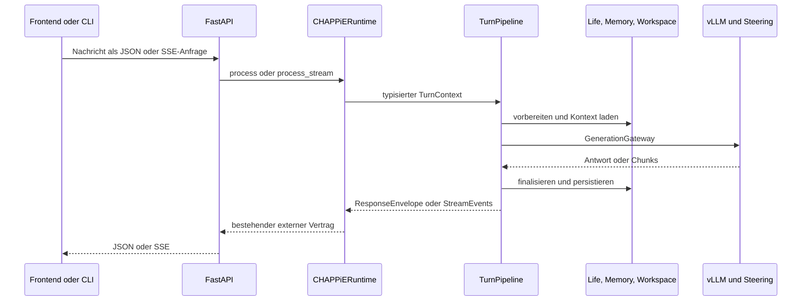
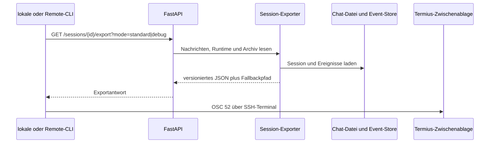

# Workflows

## Chat


```mermaid
sequenceDiagram
    participant Client as Frontend oder CLI
    participant API as FastAPI
    participant Runtime as CHAPPiERuntime
    participant Pipeline as TurnPipeline
    participant State as Life, Memory, Workspace
    participant Model as vLLM und Steering

    Client->>API: Nachricht als JSON oder SSE-Anfrage
    API->>Runtime: process oder process_stream
    Runtime->>Pipeline: typisierter TurnContext
    Pipeline->>State: vorbereiten und Kontext laden
    Pipeline->>Model: GenerationGateway
    Model-->>Pipeline: Antwort oder Chunks
    Pipeline->>State: finalisieren und persistieren
    Pipeline-->>Runtime: ResponseEnvelope oder StreamEvents
    Runtime-->>API: bestehender externer Vertrag
    API-->>Client: JSON oder SSE
```

Die feste fachliche Reihenfolge lautet:

1. Eingabe, Session und Zeitkontext normalisieren.
2. Life-Turn vorbereiten.
3. Intent, Toolentscheidungen und Emotionsdelta ermitteln.
4. STM, LTM, Keyword-RAG und Workspace-Kontext aufbauen.
5. Prompt und Steering-Kontext erzeugen.
6. über den aktuellen vLLM-Brain generieren.
7. Antwort parsen, sanitizen und formatieren.
8. Life, Chat und Memory finalisieren.

Sync und Stream teilen Vorbereitung und Abschluss. Streaming wandelt Chunks in die bestehende Eventfolge um und persistiert auch bei erfolgreichem Streamabschluss.

## Session-Export


```mermaid
sequenceDiagram
    participant Terminal as lokale oder Remote-CLI
    participant API as FastAPI
    participant Export as Session-Exporter
    participant Store as Chat-Datei und Event-Store
    participant Mac as Termius-Zwischenablage

    Terminal->>API: GET /sessions/{id}/export?mode=standard|debug
    API->>Export: Nachrichten, Runtime und Archiv lesen
    Export->>Store: Session und Ereignisse laden
    Export-->>API: versioniertes JSON plus Fallbackpfad
    API-->>Terminal: Exportantwort
    Terminal->>Mac: OSC 52 über SSH-Terminal
```

Jeder Export wird zusätzlich als Datei mit restriktiven Rechten unter `data/session_exports/` gespeichert. Das schützt vor Datenverlust, wenn Termius, `tmux` oder eine zwischengeschaltete Terminalumgebung OSC 52 nicht weitergibt.

## Provider

Der Web-Chat löst `CHAT_PROVIDER` bewusst als vLLM auf und verwendet bei Runtime-Reload immer das aktuelle konfigurierte vLLM-Modell. Der gespeicherte Schalter `enable_two_step_processing` bleibt abwärtskompatibel, erzeugt aber keine zweite alte Pipeline.

Ollama und Groq werden durch Brain-Factory, CLI, Training und Forschung weiterhin unterstützt. Die Fallback-Reihenfolge wurde durch das Cleanup nicht geändert.

## Memory und Sleep

Memory-Suche verbindet semantische Chroma-Treffer mit einer lokalen Keyword-/Entity-Suche. Der finale Prompt begrenzt beide Quellen durch bestehende Top-K- und Tokenregeln.

Sleep wird zeit-, interaktions- oder commandbasiert ausgelöst. `memory/sleep_phase.py` übernimmt Replay und Konsolidierung. Das Cleanup ändert weder Speicherformat noch Vergessenskurve.

## Training

```text
config/training_config.json
        -> python3 -m Chappies_Trainingspartner.training_daemon
        -> training_loop.py
        -> data/training_runtime/
```

`training_daemon.py` ist der systemd-Entrypoint; `training_loop.py` ist nur die Schleife. API und Frontend steuern den Daemon über `daemon_manager.py`. Eine alte Root-Datei `training_config.json` bleibt lesbar, neue Writes verwenden `config/training_config.json`.

Training lädt Providerklassen lazy. Damit können Status-, Config- und Lifecycle-Tests ohne GPU-Stack laufen.

## Forschung

Der Research-Harness darf die Runtime mit isoliertem `runtime_data_dir`, eigener Collection und Feature-Flags erzeugen. Evidence-Dateien bleiben unter `forschung/`; eingefrorene Sessions werden nicht als produktive Laufzeitdaten behandelt.

Run-2-Antwortzeiten und Qualitätsmetriken wurden vor der Runtime-Modularisierung erhoben. Strukturtests nach der Migration sind davon getrennt und keine neuen Performance-Benchmarks.

## Entrypoints

| Zweck | Kommando |
|---|---|
| API | `python3 app.py` |
| lokaler Steering-Service | `python3 -m brain.steering_api_server` |
| lokale CLI | `python3 chappie_brain_cli.py` |
| Remote-CLI | `python3 chappie_brain_cli.py --remote` |
| Training | `python3 -m Chappies_Trainingspartner.training_daemon` |
| Frontend Dev | `cd frontend && npm run dev` |
| Frontend Build | `cd frontend && npm run build` |
