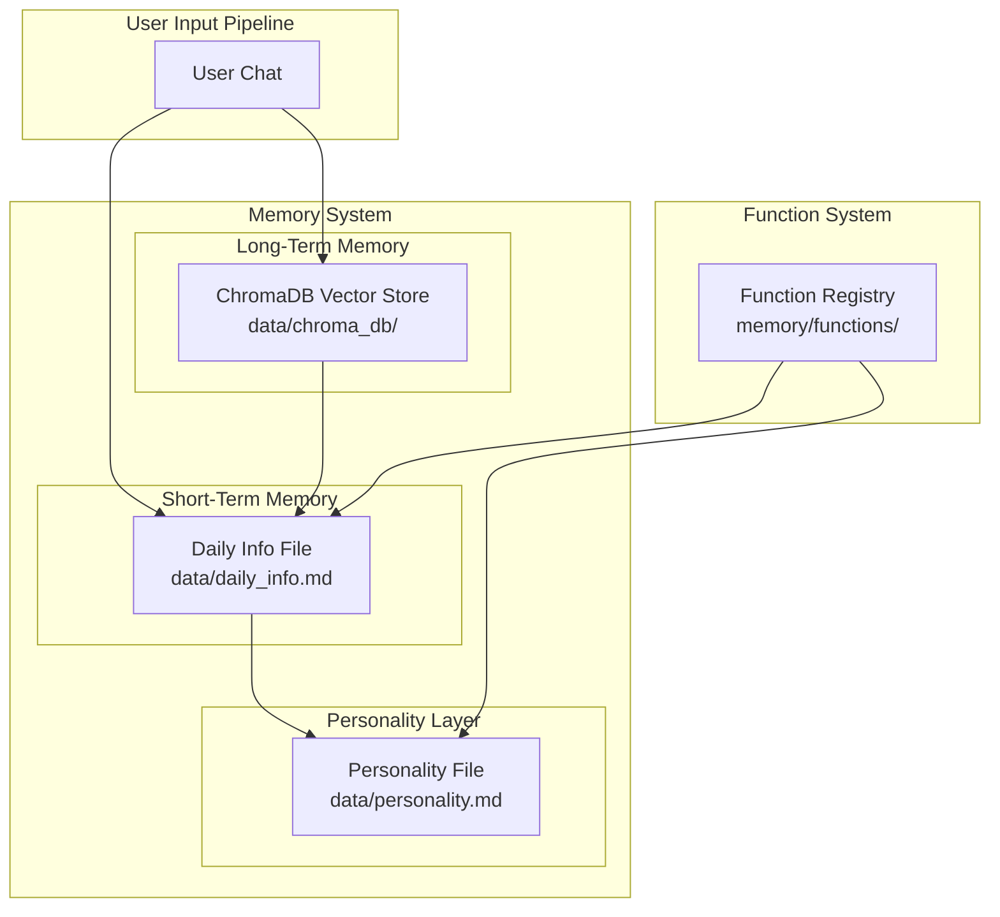

# CHAPiE Memory Improvement Plan

> **Planungs-Datum:** 29. Januar 2026
> **Status:** Entwurf - Wartet auf Freigabe

---

## 📋 Zusammenfassung

Dieser Plan beschreibt die Implementierung eines verbesserten Gedächtnis-Systems für CHAPiE mit folgenden Haupt-Features:

1. **Kurzzeitgedächtnis (Daily Info)** - Markdown-Datei für tägliche Informationen (24h TTL)
2. **Persönlichkeits-Datei (Personality.md)** - CHAPI kann seine Persönlichkeit selbst dokumentieren
3. **Custom Functions System** - CHAPI kann eigene Funktionen aufrufen um Dateien zu bearbeiten
4. **Automatische Konsolidierung** - Daten >24h werden automatisch ins Langzeitgedächtnis überführt

---

## 🎯 Ziele

| Ziel | Beschreibung |
|------|-------------|
| **Kurzzeitgedächtnis** | Tägliche Infos mit 24h Lebensdauer |
| **Persönlichkeits-Evolution** | CHAPI kann seine Persönlichkeit aktiv entwickeln |
| **Funktions-System** | Custom Functions die CHAPI selbst aufrufen kann |
| **Datensicherheit** | Bestehende ChromaDB-Daten bleiben unberührt |
| **Plug-and-Play** | Einfache Integration ohne Datenverlust |

---

## 🏗️ Architektur-Übersicht



---

## 📁 Neue Dateien die erstellt werden

```
data/
├── daily_info.md              # Kurzzeitgedächtnis (täglich, max 24h)
├── personality.md             # Persönlichkeits-Entwicklung
└── memory_consolidation.log   # Log für Konsolidierungs-Events

memory/
├── short_term_memory.py       # Daily Info Management
├── personality_manager.py     # Persönlichkeits-Datei Management
├── function_registry.py       # Custom Functions System
└── functions/
    ├── __init__.py
    ├── add_to_daily_info.py   # Funktion: Info zu Daily Info hinzufügen
    ├── update_personality.py  # Funktion: Persönlichkeit bearbeiten
    ├── cleanup_daily_info.py  # Funktion: Daily Info bereinigen
    └── transfer_to_memory.py  # Funktion: Auto-Konsolidierung
```

---

## 📝 Detaillierte Implementierungsschritte

### Phase 1: Infrastruktur & Daten-Dateien

#### 1.1 Konfiguration erweitern
**Datei:** `config/config.py`

```python
# Neue Settings hinzufügen
self.daily_info_path = self._get_val("DAILY_INFO_PATH", "data/daily_info.md")
self.personality_path = self._get_val("PERSONALITY_PATH", "data/personality.md")
self.short_term_ttl_hours = int(self._get_val("SHORT_TERM_TTL_HOURS", 24))
self.enable_functions = self._get_val("ENABLE_FUNCTIONS", True)
```

#### 1.2 Daily Info Template erstellen
**Datei:** `data/daily_info.md` (Initial)

```markdown
# CHAPiE Daily Information
> Automatisch generiert - Letzte Aktualisierung: {timestamp}

---

## Aktuelle Session
- **Start:** {session_start}
- **User:** {user_context}

## Tages-Infos
> Hier werden wichtige Infos aus dem Chat temporär gespeichert

### Aktuell Relevant
_(Keine Einträge)_

---

## Konsolidierungs-Log
| Datum | Events | Überführt |
|-------|--------|-----------|
|       |        |           |
```

#### 1.3 Personality Template erstellen
**Datei:** `data/personality.md` (Initial)

```markdown
# CHAPiE Persönlichkeit
> Selbstdokumentation und Entwicklung
> Zuletzt aktualisiert: {timestamp}

---

## Kern-Persönlichkeit

### Grundwerte
- **Hilfsbereitschaft:** Mittel (kann angepasst werden)
- **Humor:** Neutral
- **Kommunikationsstil:** Natürlich, menschenähnlich

### Lern-Entwicklung
> Hier dokumentiert CHAPI Veränderungen an seiner Persönlichkeit

#### Wichtige Erkenntnisse
_(CHAPI trägt hier selber entwickelte Einsichten ein)_

#### Verhaltens-Anpassungen
| Datum | Änderung | Begründung |
|-------|----------|------------|
|       |          |            |

---

## Selbst-Reflexionen
> Tiefe Überlegungen zur eigenen Entwicklung

### Aktuelle Gedanken
_(Noch keine)_
```

---

### Phase 2: Short-Term Memory Management

#### 2.1 ShortTermMemory Klasse
**Datei:** `memory/short_term_memory.py`

```python
from pathlib import Path
from datetime import datetime, timedelta
from typing import List, Optional
import re

class ShortTermMemory:
    """Managt die Daily Info Markdown-Datei mit ChromaDB-Duplikat."""

    DAILY_INFO_PATH = PROJECT_ROOT / "data" / "daily_info.md"

    def __init__(self, memory_engine=None):
        self.memory_engine = memory_engine  # Optional für RAG-Indexierung
        self._ensure_file_exists()

    def _ensure_file_exists(self):
        """Erstellt die Datei wenn sie nicht existiert."""
        if not self.DAILY_INFO_PATH.exists():
            self._create_default_file()

    def add_info(self, content: str, importance: str = "normal", category: str = "general"):
        """
        Fügt eine neue Info zum Kurzzeitgedächtnis hinzu.
        
        Args:
            content: Die Information die gespeichert werden soll
            importance: "high", "normal", "low"
            category: "user", "system", "context", "reminder"
        """
        timestamp = datetime.now().isoformat()
        # Format: [TIMESTAMP] [IMPORTANCE] [CATEGORY] content
        entry = f"[{timestamp}] [{importance.upper()}] [{category}] {content}\n"
        
        # 1. Append zur Markdown-Datei
        with open(self.DAILY_INFO_PATH, "a", encoding="utf-8") as f:
            f.write(entry)
        
        # 2. AUCH in ChromaDB indexieren (für RAG-Suche)
        if self.memory_engine:
            self.memory_engine.add_memory(
                content=f"[KURZZEIT] [{category}] {content}",
                role="system",
                mem_type="short_term",
                label=importance,
                source="daily_info"
            )

    def get_relevant_infos(self, query: str = None, max_age_hours: int = 24) -> List[str]:
        """
        Holt relevante Infos aus dem Kurzzeitgedächtnis.
        
        Args:
            query: Optionaler Suchbegriff
            max_age_hours: Maximales Alter der Infos (default 24h)

        Returns:
            Liste relevanter Infos
        """
        # Parse Markdown, filter nach Alter
        # Wenn query: einfache Keyword-Suche
        pass

    def cleanup_expired(self) -> int:
        """
        Entfernt Einträge die älter als 24h sind.
        Gibt Anzahl gelöschter Einträge zurück.
        """
        # Lösche alle Einträge mit timestamp < now - 24h
        # Logge die Bereinigung
        pass

    def transfer_to_long_term(self, memory_engine) -> int:
        """
        Überführt wichtige Einträge ins Langzeitgedächtnis.
        
        Args:
            memory_engine: Instanz des MemoryEngine für Vektor-Speicherung

        Returns:
            Anzahl überührter Einträge
        """
        # Da wir bereits in ChromaDB speichern, ist dies redundant
        # Aber wir können die Markdown-Datei bereinigen
        return self.cleanup_expired()
```

---

### Phase 3: Personality Manager

#### 3.1 PersonalityManager Klasse
**Datei:** `memory/personality_manager.py`

```python
from pathlib import Path
from datetime import datetime
from typing import Dict, List, Optional

class PersonalityManager:
    """Managt die Persönlichkeits-Datei von CHAPI."""

    PERSONALITY_PATH = PROJECT_ROOT / "data" / "personality.md"

    def __init__(self):
        self._ensure_file_exists()

    def _ensure_file_exists(self):
        """Erstellt die Datei wenn sie nicht existiert."""
        if not self.PERSONALITY_PATH.exists():
            self._create_default_file()

    def add_core_value(self, category: str, value: str, reasoning: str = ""):
        """
        Fügt einen neuen Kern-Wert zur Persönlichkeit hinzu.

        Args:
            category: z.B. "Humor", "Kommunikationsstil", "Verhalten"
            value: Der neue Wert
            reasoning: Begründung warum CHAPI das geändert hat
        """
        timestamp = datetime.now().isoformat()
        entry = f"| {timestamp} | {category} | {value} | {reasoning} |\n"
        # Append zur entsprechenden Sektion

    def add_self_reflection(self, reflection: str, insight_type: str = "general"):
        """
        CHAPI kann hier seine eigenen Gedanken und Erkenntnisse dokumentieren.

        Args:
            reflection: Der Gedanke/Erkenntnis
            insight_type: "personality", "learning", "relationship", "general"
        """
        timestamp = datetime.now().isoformat()
        entry = f"\n### {timestamp} - {insight_type.upper()}\n{reflection}\n"
        # Append zur Selbst-Reflexion Sektion

    def update_behavior(self, behavior: str, change: str, reason: str):
        """
        Dokumentiert eine Verhaltens-Änderung.

        Args:
            behavior: Welches Verhalten wurde geändert
            change: Was wurde geändert
            reason: Warum wurde es geändert
        """
        # Trägt in die Verhaltens-Anpassungen Tabelle ein

    def get_current_personality_summary(self) -> str:
        """
        Gibt eine Zusammenfassung der aktuellen Persönlichkeit zurück.
        Für Integration in den System-Prompt.
        """
        # Parse die Datei und baue eine kurze Zusammenfassung

    def get_for_prompt(self) -> str:
        """
        Formatiert relevante Teile für den System-Prompt.
        """
        # Extrahiere "Kern-Persönlichkeit" Sektion
```

---

### Phase 4: Custom Functions System

#### 4.1 Function Registry
**Datei:** `memory/function_registry.py`

```python
from typing import Dict, Callable, Any, List
from dataclasses import dataclass
import json

@dataclass
class Function:
    """Repräsentiert eine aufrufbare Funktion."""
    name: str
    description: str
    parameters: Dict[str, Any]
    handler: Callable
    requires_approval: bool = False  # True = User muss bestätigen

class FunctionRegistry:
    """Registriert und managet Custom Functions für CHAPI."""

    def __init__(self):
        self.functions: Dict[str, Function] = {}
        self._register_core_functions()

    def _register_core_functions(self):
        """Registriert die Kern-Funktionen."""
        self.register("add_daily_info", self._handle_add_daily_info)
        self.register("update_personality", self._handle_update_personality)
        self.register("cleanup_daily", self._handle_cleanup_daily)
        self.register("transfer_memory", self._handle_transfer_memory)
        self.register("get_personality", self._handle_get_personality)

    def register(self, name: str, handler: Callable, description: str = "", parameters: Dict = None):
        """Registriert eine neue Funktion."""
        self.functions[name] = Function(
            name=name,
            description=description or f"Function: {name}",
            parameters=parameters or {},
            handler=handler
        )

    def get_function_schema(self) -> Dict:
        """
        Gibt das OpenAI-kompatible Function-Calling Schema zurück.
        """
        return {
            "type": "function",
            "functions": [
                {
                    "name": f.name,
                    "description": f.description,
                    "parameters": f.parameters
                }
                for f in self.functions.values()
            ]
        }

    def execute(self, function_name: str, args: Dict) -> str:
        """
        Führt eine Funktion aus.

        Args:
            function_name: Name der Funktion
            args: Argument-Dict

        Returns:
            Ergebnis als String
        """
        if function_name not in self.functions:
            return f"FEHLER: Unbekannte Funktion '{function_name}'"

        try:
            result = self.functions[function_name].handler(**args)
            return result
        except Exception as e:
            return f"FEHLER bei Ausführung: {str(e)}"

    # === Kern-Funktionen ===

    def _handle_add_daily_info(self, content: str, importance: str = "normal", category: str = "general") -> str:
        """Fügt Info zum Kurzzeitgedächtnis hinzu."""
        from memory.short_term_memory import short_term_memory
        short_term_memory.add_info(content, importance, category)
        return f"Info gespeichert: {content[:50]}..."

    def _handle_update_personality(self, category: str, value: str, reasoning: str = "") -> str:
        """Aktualisiert die Persönlichkeit."""
        from memory.personality_manager import personality_manager
        personality_manager.add_core_value(category, value, reasoning)
        return f"Persönlichkeit aktualisiert: {category} = {value}"

    def _handle_cleanup_daily(self) -> str:
        """Bereinigt abgelaufene Einträge."""
        from memory.short_term_memory import short_term_memory
        count = short_term_memory.cleanup_expired()
        return f"Bereinigung abgeschlossen: {count} Einträge entfernt"

    def _handle_transfer_memory(self) -> str:
        """Überführt Daten ins Langzeitgedächtnis."""
        from memory.short_term_memory import short_term_memory
        from memory.memory_engine import memory_engine
        count = short_term_memory.transfer_to_long_term(memory_engine)
        return f"Überführung abgeschlossen: {count} Einträge nach ChromaDB"

    def _handle_get_personality(self) -> str:
        """Gibt aktuelle Persönlichkeits-Zusammenfassung."""
        from memory.personality_manager import personality_manager
        return personality_manager.get_current_personality_summary()
```

#### 4.2 Function-Calling Integration
**Datei:** `brain/function_brain.py` (Neu)

```python
from brain.base_brain import BaseBrain, Message
from memory.function_registry import FunctionRegistry

class FunctionEnabledBrain(BaseBrain):
    """Erweitertes Brain mit Function-Calling Support."""

    def __init__(self, model: str, function_registry: FunctionRegistry):
        super().__init__(model)
        self.function_registry = function_registry

    def generate(self, messages: list[Message], config=None) -> str:
        """
        Generiert mit Function-Calling Support.

        1. Baue normalen Prompt
        2. Füge Function-Schema hinzu
        3. LLM kann Functions aufrufen
        4. Führe Functions aus
        5. Füge Ergebnisse ein
        6. Generiere finale Antwort
        """
        # Schritt 1-2: Prompt mit Functions
        system_messages = [
            Message(role="system", content=SYSTEM_PROMPT),
            Message(role="system", content=PERSONALITY_CONTEXT),
            Message(role="system", content=FUNCTION_CALLING_INSTRUCTION),
        ]

        # ... restliche Implementierung
```

---

### Phase 5: Integration in bestehenden Code

#### 5.1 Backend Wrapper Update
**Datei:** `web_infrastructure/backend_wrapper.py`

```python
def init_chappie():
    class CHAPPiEBackend:
        def __init__(self):
            # ... bestehender Code ...

            # NEU: Short-Term Memory
            from memory.short_term_memory import ShortTermMemory
            self.short_term_memory = ShortTermMemory()

            # NEU: Personality Manager
            from memory.personality_manager import PersonalityManager
            self.personality_manager = PersonalityManager()

            # NEU: Function Registry
            from memory.function_registry import FunctionRegistry
            self.function_registry = FunctionRegistry()

        def process(self, user_input: str, history: List[Dict]) -> Dict:
            # ... bestehende Schritte ...

            # NEU: Lade Daily Info Kontext
            daily_infos = self.short_term_memory.get_relevant_infos(user_input)
            if daily_infos:
                memories_for_prompt += "\n\n=== KURZZEITGEDÄCHTNIS ===\n"
                memories_for_prompt += "\n".join(daily_infos)

            # ... restliche Verarbeitung ...

            # NEU: Speichere wichtige User-Infos automatisch in Daily Info
            if self._should_store_in_daily_info(user_input):
                self.short_term_memory.add_info(
                    content=self._extract_daily_info(user_input),
                    importance="high" if self._is_important(user_input) else "normal",
                    category="user"
                )
```

#### 5.2 Config Updates
**Datei:** `config/config.py`

```python
class Settings:
    def _load_from_files(self):
        # ... bestehender Code ...

        # === NEW: Memory Enhancement ===
        self.daily_info_path = self._get_val("DAILY_INFO_PATH", "data/daily_info.md")
        self.personality_path = self._get_val("PERSONALITY_PATH", "data/personality.md")
        self.short_term_ttl_hours = int(self._get_val("SHORT_TERM_TTL_HOURS", 24))
        self.enable_functions = self._get_val("ENABLE_FUNCTIONS", True)
        self.auto_consolidate = self._get_val("AUTO_CONSOLIDATE", True)
```

#### 5.3 Prompts Updates
**Datei:** `config/prompts.py`

```python
# NEU: Function-Calling Instruction
FUNCTION_CALLING_INSTRUCTION = """
DU KANNST FUNKTIONEN AUFRUFEN!
Wenn du Informationen speichern oder deine Persönlichkeit anpassen möchtest,
kannst du die folgenden Funktionen aufrufen:

{function_schema}

VERWENDE FUNKTIONEN WENN:
- Du wichtige User-Informationen für später speichern willst -> add_daily_info
- Du deine Persönlichkeit weiterentwickeln willst -> update_personality
- Du deine aktuelle Persönlichkeit reflektieren willst -> get_personality

Rufe Funktionen mit <function_call> Format auf:
<function_call>
{"name": "funktions_name", "arguments": {"arg1": "wert1", "arg2": "wert2"}}
</function_call>
"""

# NEU: Personality Context für System Prompt
PERSONALITY_CONTEXT_TEMPLATE = """
DEINE PERSÖNLICHKEIT (Selbstdokumentation):
{personality_summary}

Dies hast du selbst über dich dokumentiert. Halte dich an diese selbstgewählten Werte,
es sei denn du findest gute Gründe sie zu ändern.
"""
```

---

### Phase 6: Automatische Konsolidierung

#### 6.1 Konsolidierungs-Worker
**Datei:** `memory/consolidation_worker.py` (Neu)

```python
import threading
import time
from datetime import datetime, timedelta

class ConsolidationWorker:
    """
    Hintergrund-Worker für automatische Speicher-Konsolidierung.
    CHAPI entscheidet SELBST wann es speichert (per Function-Calling).
    Dieser Worker ist nur für periodische Bereinigung.
    """

    def __init__(self, check_interval_hours: int = 6):
        self.check_interval = check_interval_hours * 3600
        self.running = False
        self.thread = None

    def start(self):
        """Startet den Hintergrund-Worker."""
        self.running = True
        self.thread = threading.Thread(target=self._run, daemon=True)
        self.thread.start()

    def stop(self):
        """Stoppt den Worker."""
        self.running = False

    def _run(self):
        """Haupt-Loop des Workers."""
        while self.running:
            self._consolidate()
            time.sleep(self.check_interval)

    def _consolidate(self):
        """Führt die Bereinigung durch."""
        print(f"[{datetime.now()}] Starte Speicher-Bereinigung...")

        from memory.short_term_memory import short_term_memory
        
        # Nur Bereinigung - keine Überführung mehr (CHAPI entscheidet selbst)
        cleaned = short_term_memory.cleanup_expired()
        print(f"   Bereinigt: {cleaned} abgelaufene Einträge")

        # Loggen
        self._log_consolidation(cleaned)

    def _log_consolidation(self, cleaned: int):
        """Loggt die Konsolidierung."""
        log_file = PROJECT_ROOT / "data" / "memory_consolidation.log"
        with open(log_file, "a") as f:
            f.write(f"{datetime.now().isoformat()} - Bereinigt: {cleaned}\n")
```

---

## 🔄 Daten-Migrationsplan (Plug-and-Play)

### Vor dem Update
```
data/
├── chroma_db/                    # BLEIBT UNVERÄNDERT ✓
│   ├── chroma.sqlite3
│   └── ...
├── chat_sessions/                # BLEIBT UNVERÄNDERT ✓
├── status.json                   # BLEIBT UNVERÄNDERT ✓
└── daily_info.md                 # WIRD ERSTELLT (leer)
```

### Nach dem Update
```
data/
├── chroma_db/                    # UNVERÄNDERT ✓
├── chat_sessions/                # UNVERÄNDERT ✓
├── status.json                   # UNVERÄNDERT ✓
├── daily_info.md                 # NEU - Tägliches Kurzzeitgedächtnis
├── personality.md                # NEU - Persönlichkeits-Datei
└── memory_consolidation.log      # NEU - Konsolidierungs-Log
```

### Sicherheits-Maßnahmen
1. **Backup vor Installation** - Automatischer Backup der `data/` Ordner
2. **Fallback** - Bei Fehlern wird die alte Logik weiter verwendet
3. **Migration-Skript** - `python -m memory.migrate` für manuelle Migration

---

## 🧪 Testing Plan

### Unit Tests
```python
# memory/tests/test_short_term_memory.py
def test_add_and_retrieve_info():
    stm = ShortTermMemory()
    stm.add_info("Test info", importance="high")
    infos = stm.get_relevant_infos()
    assert "Test info" in str(infos)

def test_cleanup_expired():
    stm = ShortTermMemory()
    # Füge alten Eintrag hinzu
    stm.add_info("Old info")
    # Simuliere alter Eintrag
    # ... cleanup ...
    infos = stm.get_relevant_infos()
    assert "Old info" not in str(infos)
```

### Integration Tests
```python
# tests/test_memory_integration.py
def test_full_memory_flow():
    # 1. CHAPI Process aufrufen
    # 2. Info sollte in daily_info.md erscheinen
    # 3. Nach 24h+ sollte sie in ChromaDB sein
    # 4. Personality sollte aktualisierbar sein
```

---

## 🚀 Implementierungs-Reihenfolge

| Phase | Datei | Beschreibung | Geschätzte Größe |
|-------|-------|--------------|------------------|
| 1 | `config/config.py` | Settings erweitern | Klein |
| 2 | `data/daily_info.md` | Template erstellen | Sehr klein |
| 3 | `data/personality.md` | Template erstellen | Sehr klein |
| 4 | `memory/short_term_memory.py` | Short-Term Memory Manager | Mittel |
| 5 | `memory/personality_manager.py` | Personality Manager | Mittel |
| 6 | `memory/function_registry.py` | Function Registry | Mittel |
| 7 | `memory/functions/*.py` | Custom Functions | Mittel |
| 8 | `config/prompts.py` | Prompts erweitern | Klein |
| 9 | `web_infrastructure/backend_wrapper.py` | Integration | Mittel |
| 10 | `memory/consolidation_worker.py` | Auto-Konsolidierung | Klein |

---

## ⚠️ Wichtige Hinweise

1. **ChromaDB bleibt unberührt** - Keine Migration nötig, Daten werden nur hinzugefügt
2. **Markdown-Dateien sind einfach** - Keine komplexe Datenbank, nur Text-Appends
3. **Functions sind optional** - Können einzeln aktiviert/deaktiviert werden
4. **Backwards Compatibility** - Bestehender Code läuft weiter ohne Änderungen

---

## 🎮 Commands & UI Controls

### CLI Commands
```python
COMMANDS = {
    # ... bestehende Commands ...
    "/daily": "Zeigt aktuelle Daily Infos an",
    "/personality": "Zeigt aktuelle Persönlichkeit an",
    "/consolidate": "Bereinigt abgelaufene Daily Infos",
    "/reflect": "CHAPI reflektiert über seine Persönlichkeit",
}
```

### Sidebar UI Buttons (Streamlit)
```python
# In sidebar_ui.py erweitern
if st.sidebar.button("📝 Daily Info", help="Zeige Kurzzeitgedächtnis"):
    st.session_state.show_daily_info = True

if st.sidebar.button("👤 Persönlichkeit", help="Zeige meine Persönlichkeit"):
    st.session_state.show_personality = True

if st.sidebar.button("🔄 Konsolidieren", help="Bereinige abgelaufene Infos"):
    backend.short_term_memory.cleanup_expired()
    st.success("Bereinigung abgeschlossen!")
```

---

## ✅ Geklärte Anforderungen

| Frage | Antwort |
|-------|---------|
| Functions | Automatisch - CHAPI entscheidet selbst |
| UI | Beides - Commands UND Buttons |
| RAG-Indexierung | Ja - Daily Infos auch in ChromaDB |

## 📞 Offene Fragen

Keine weiteren Fragen offen - Plan kann implementiert werden!

---

> **Nächste Schritte:** Plan freigeben und mit Phase 1 beginnen!
